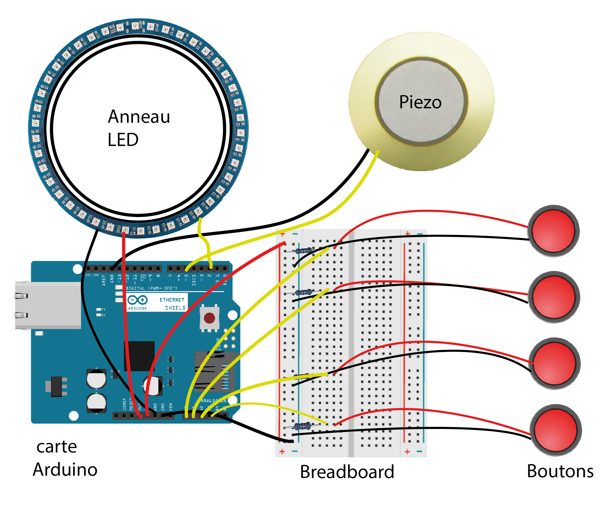

[**home**](../README.md)

# Les boutons musicaux
 
Les boutons musicaux est un jeu électronique inspiré des chaises musicales.

Avec une carte Arduino Uno, on devait en groupe concevoir un jeu électronique simple mais drôle.

Ce projet a été mené dans le cadre du module connectivité en 3ème année de bachelor à l'école de design Nantes Atlantique.

*Composition du groupe "Pink" : Aurelien Colloc, Léa Ganais et Meriem Gharbi*

 
## Présentation du jeu 

### Concept

 
Nous vous proposons une revisite, de l'illustre jeu de la chaise musicale.

Comme dans le jeu original, il y a une musique qui guide les joueurs. Toutefois, à la place des chaises on met des boutons. Et on utilise des Leds pour guider les joueurs entre les manches.

Le jeu est composé d’un boîtier central auquel sont reliés des boutons

(4 exactement). Il y a une succession de tours/manches et à l’issue de celles-ci un des joueurs est éliminé.

Dans notre exemple, il y a 4 participants et donc 3 manches pour éliminer 3 joueurs et déterminer le gagnant puisqu’il faut être le dernier pour remporter la partie.

Pour être le vainqueur, il faut être le plus rapide à presser le bouton à l'arrêt de la musique et de l’animation lumineuse.

Le dernier à appuyer sur le bouton est éliminé et doit attendre la fin de partie pour recommencer.

A noter, à chaques éliminations le jeu indique grâce aux LED qui est éliminé.

  

### Matériel utilisé

- Une carte Arduino Uno

- Une Breadboard

- Un haut parleur (un Piezo de préférence)

- Des boutons (nombre ajustable selon le nombre de joueur maximal souhaiter)

- Résistances de 10K (x4)

- Un anneau de Led (un ruban de Led ou des Leds classiques peuvent faire l'affaire)

- Des câbles pour relier le tout

### Schéma de montage

### Scénario d'usage
Un jeu de société, pour des groupes d'amis qui souhaitent s'amuser 
https://www.youtube.com/watch?v=MnPmntuMb7s

<iframe src="https://www.youtube.com/embed/MnPmntuMb7s" frameborder="0" allow="accelerometer; autoplay; encrypted-media; gyroscope; picture-in-picture" allowfullscreen></iframe>

[**home**](../README.md)