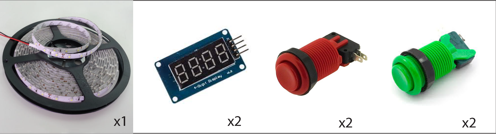
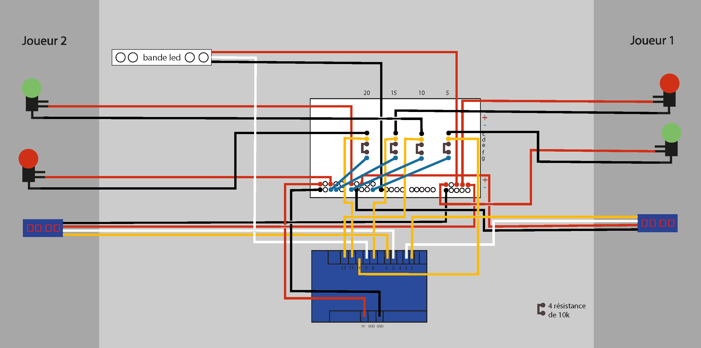
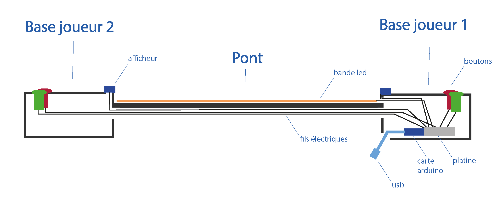

[**home**](../README.md)

# Notice de montage

## **Matériel**
 - Deux boutons rouges
 - Deux boutons verts
 - Deux afficheurs (digit led tube)
 - Une bande led
 

 

 - Carton / carton plume ou bois + scotch (pour la maquette)

## **Assemblage** 
### **Parties non électroniques**

 1. Création de **deux boites** pour les deux bases (pouvant contenir les pièces électroniques) donc environ 17x20 cm (largeur x longueur) et 9 cm de hauteur.

 2. Faire **deux trous ronds** (environ 3.2 cm) sur la face du dessus de chaque boite (pour pouvoir y insérer les boutons plus tard), pas trop gros ni trop petits pour qu'ils ne bougent pas. 

 3. Créer une **longue planche** au moins aussi large que la bande led et avec 2-3 centimètres de longueur en plus que cette dernière. 

 4. **Assembler** le pont avec les deux bases (aux deux bouts).

 5. Faire un **petit trou** de 1-2 cm sur les deux bases, juste sous le pont (pour pouvoir y passer les fils plus tard).

### **Parties électroniques**

6. Reproduire le **schéma électronique** ci-desous:

7. Assembler et disposer les éléments éléctroniques dans la maquette comme sur le tableau et l'image ci-dessous. Allonger et souder les fils électriques si ils sont trop courts.

|       |caché à l'intérieur |visible de l'extérieur                |
|----------------|-------------------------------|-----------------------------|
|**Base joueur 1**| Carte Arduino et sa platine, partie non actionnable des boutons verts et rouges du J1, fils de l'afficheur J1, fils électriques (Montage)              | afficheur J1, partie actionnable des boutons verts et rouges du J1            |
|**Base joueur 2**          |partie non actionnable des boutons verts et rouges du J2, fils de l'afficheur J2,             |afficheur J2, partie actionnable des boutons verts et rouges du J2             |
|**Pont**          |Fil électrique correspondant aux boutons et à l'afficheur du J2 (sous le pont) |Bande led (posée sur le pont)|

8. **Fermer** les deux bases (laisser un trou pour accéder au câble usb). et **cacher** les fils sous le pont avec du scotch.

9. Brancher le câble usb de la carte arduino à l'ordinateur et y **téléverser le code** (ci-joint).

10. Si le code fonctionne, vous pouvez débrancher l'ordinateur et mettre une batterie externe.

[**home**](../README.md)