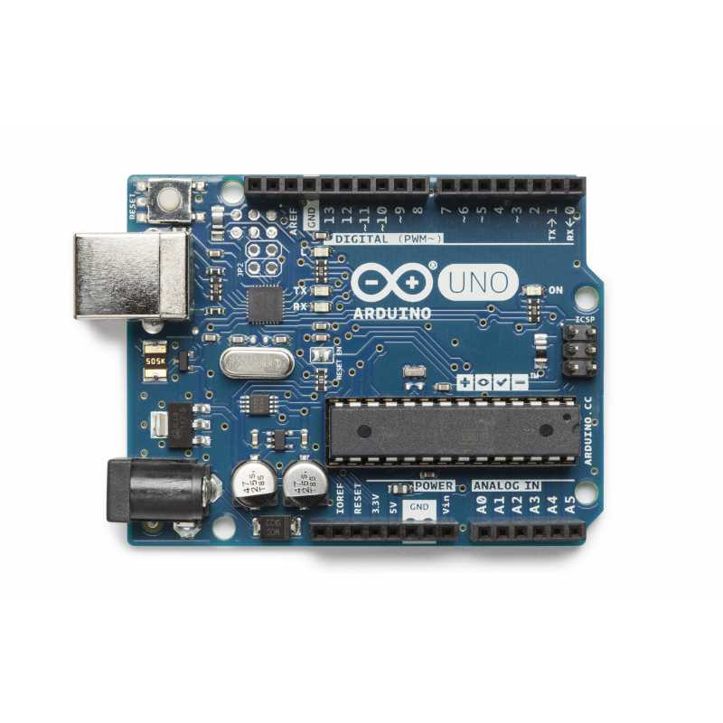
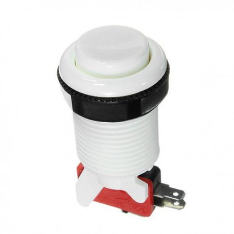
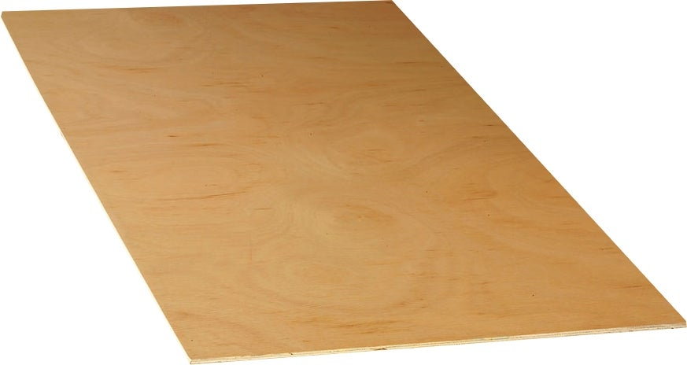
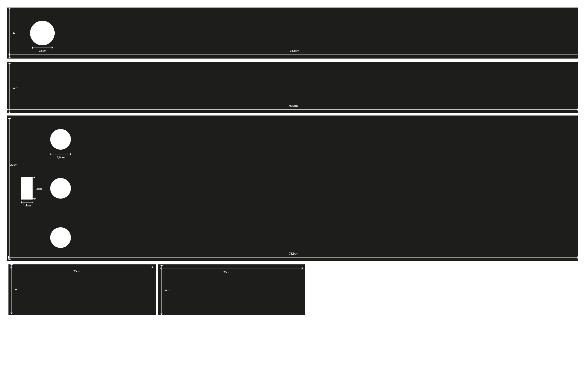
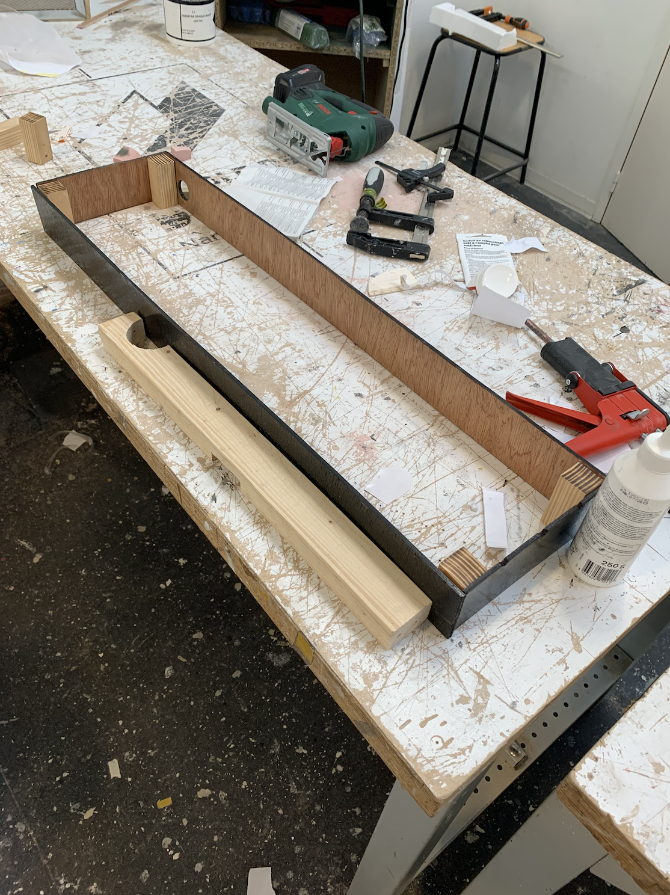
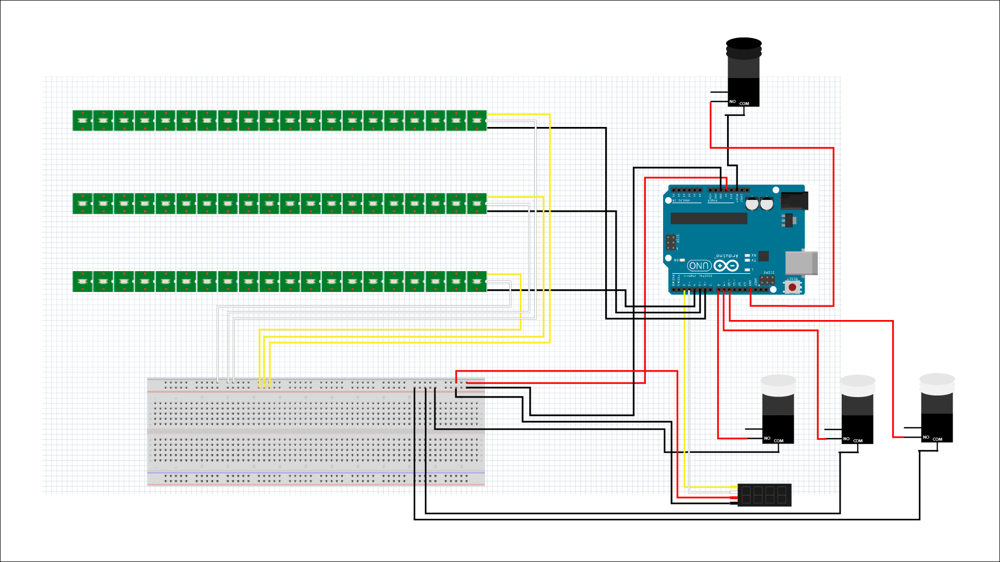
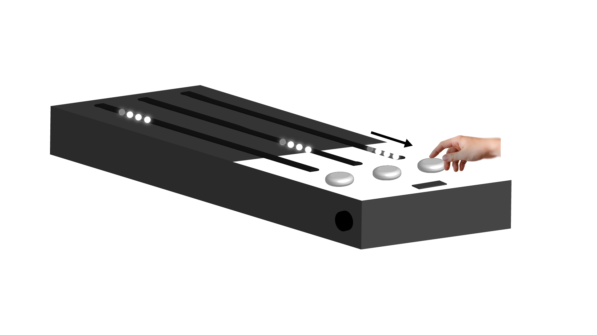

[**home**](../README.md)

# LA GUITARE POUR LES HÉROS

Allan Guégan et Simon Heurtebise


## 1 • Présentation du projet:
Dans le cadre de notre cours d'Arduino, nous devions réaliser en binôme, un jeu très simple. 
Nous avions à disposition une carte arduino ainsi que différents composants.

## 2 • Principe du jeu

Détruisez les tuiles lumineuses ! 
Pour cela, il faut appuyer sur les boutons attitrés quand la tuile correspondante dépasse la zone claire. 
La vitesse augmente tout au long du jeu.

Vous êtes éliminé si vous appuyez trop tôt, c’est à dire avant que la led de tête n’arrive entièrement dans la zone claire. N’appuyez pas trop tard non plus, appuyez avant que la tuile lumineuse disparaisse. 

Le nombre de points augmentent par temps de pression. Plus vous appuyez longtemps, plus vous remportez des points. Attention à ne pas rester 
appuyer trop longtemps, vous risquez de perdre la partie.


## 3 • Le matériel utilisé
Voici les composants que nous avons utilisé pour ce projet:

- 1 carte Arduino Uno.


- 4 boutons poussoirs (3 boutons de jeu et 1 bouton pour reset).


- 3 rubans de 20 LED RGB.


- Une planche de contre plaquée (50x80cm) de 5mm d'épaisseur.



- Peinture aérosol noir et blanche.


## 4 • Les cotes de la boite

Voici les cotes de la boite que nous avons créé.



Nous avons tracé ces mesures sur la palque de contre-plaqué.


Nous avons réalisé les découpes à suivre avant d'assembler chaque partie entre elles.


Ensuite, à l'atelier, nous avons monté et fixé toutes les planches de bois ensemble.



Nous avons placé l'ensemble de l'électronique à l'interieur de la boite. 


## 6 • Le schéma






## 5 • Le code

Voir le code complet et commenté ci-joint dans le dossier "projet_final.ino"


Puis toujours avant le setup(), on déclare la bibliothèque "Adafruit_NeoPixel" qui permet de gérer les LED  :


```c
#include <Adafruit_NeoPixel.h>
#include "avdweb_VirtualDelay.h"
#include <Arduino.h>

```

Nous venons définir sur quel PIN les composants sont positionnés:

```c
const byte PIN_CLK = 2;   // On vient déclarer où l'on branche le CLK (Pour l'afficheur de score)
const byte PIN_DIO = 3;   // On vient déclarer où l'on branche le DIO (Pour l'afficheur de score)
SevenSegmentTM1637    display(PIN_CLK, PIN_DIO);


#define BP1     8 // On vient déclarer où l'on branche le bouton 1
#define BP2     9 // On vient déclarer où l'on branche le bouton 2
#define BP3     10 // On vient déclarer où l'on branche le bouton 3

#define LED_PIN1     6 // On vient déclarer où l'on branche le ruban de led 1
#define LED_PIN2     5 // On vient déclarer où l'on branche le ruban de led 2
#define LED_PIN3     4 // On vient déclarer où l'on branche le ruban de led 3

```
Nous définissons le nombre de LED sur chaque ruban:

```c
#define LED_COUNT  20
```

Nous définissons le nombre de LED sur chaque ruban:

```c
int var = 100;
#include "SevenSegmentTM1637.h"
```


Ensuite, nous définissons le delay de nos LED:

```c
Adafruit_NeoPixel strip1(LED_COUNT, LED_PIN1, NEO_GRB + NEO_KHZ800);
int index1 = 0;
VirtualDelay delay1; // Le délai est virtuel, pendant le délai, l'exécution du code se poursuit et donc est non bloquant
int dureeDelay1 = 400;


Adafruit_NeoPixel strip2(LED_COUNT, LED_PIN2, NEO_GRB + NEO_KHZ800);
int index2 = 0;
VirtualDelay delay2; // Le délai est virtuel, pendant le délai, l'exécution du code se poursuit et donc est non bloquant
int dureeDelay2 = 500;


Adafruit_NeoPixel strip3(LED_COUNT, LED_PIN3, NEO_GRB + NEO_KHZ800);
int index3 = 0;
VirtualDelay delay3; // Le délai est virtuel, pendant le délai, l'exécution du code se poursuit et donc est non bloquant
int dureeDelay3 = 400;
```

Nous définissions que le score de base est égal à 0.

```c
int score = 0;
```

Nous venons définir les paramètres et le delay de l'aficheur.

```c
  // Afficheur
  display.begin();            // On initialise le display
  display.setBacklight(100);  // On définit la luminosité à 100 %
  display.print("GO");      // On initialise en affichant "GO" sur l'afficheur
  delay(1000);                // On attend 1000 ms
  display.clear();
```
  
  
Voici le setup complet. Il s'agit de l'emplacement ou nous venons définir des caractéristiques aux composants que nous aurons branché:
  
  
```c
  void setup() {
  Serial.begin(9600);
  strip1.begin();           // INITIALIZE NeoPixel strip object
  strip1.show();            // Turn OFF all pixels ASAP
  pinMode(BP1, INPUT_PULLUP);

  strip2.begin();           // INITIALIZE NeoPixel strip object
  strip2.show();            // Turn OFF all pixels ASAP
  pinMode(BP2, INPUT_PULLUP);

  strip3.begin();           // INITIALIZE NeoPixel strip object
  strip3.show();            // Turn OFF all pixels ASAP
  pinMode(BP3, INPUT_PULLUP);


  // Afficheur
  display.begin();            // On initialise le display
  display.setBacklight(100);  // On définit la luminosité à 100 %
  display.print("GO");      // On initialise en affichant "GO" sur l'afficheur
  delay(1000);                // On attend 1000 ms
  display.clear();

  // On définit un délai aléatoire entre deux valeurs pour chaque ruban de led
  randomSeed(analogRead(0));
  dureeDelay1 = random(20, 300);
  dureeDelay2 = random(25, 350);
  dureeDelay3 = random(30, 400);
}
```

Ensuite, nous venons créer une boucle évolutive. Ce qui veut dire que nous venons activer et désactiver des leds afin de créer un chenillard. Une fois que le chenillard a fait un tour, nous pouvons lui donner des caractéristiques qui viennent se rajouter petit à petit. 
Voici les démarches pour le premier bouton:

```c
void loop() {
  display.clear();
  display.print(score);
  if (gameOn == true) {

    // Logique pour le bouton 1 et le ruban de led 1
    // Ici -> On anime les leds basées sur un délai virtuel et non bloquant
    delay1.start(dureeDelay1);
    if (delay1.elapsed()) {
      // ce code est éxecuté à chaque fois que le délai est écoulé
      index1 += 1; // on déplace le chenillard
      index1 = index1 % LED_COUNT; // boucler sur le strip de led
      if (index1 % LED_COUNT == 0) { // si on arrive au bout on accélère
        dureeDelay1 = random(20, 300);   // On définit un délai aléatoire entre deux valeurs pour chaque ruban led
        dureeDelay1 = constrain(dureeDelay1, 20, 300);
        // Si le bouton 3 n'est pas préssé au moment où les leds rentre dans la zone de clique -> Game Over
        if (b1Pressed == false) {
          gameOn = false;
        }
        b1Pressed = false;
      }

    }
    if (digitalRead (BP1) == LOW  && index1 > LED_COUNT - 4 && index1 < LED_COUNT) {
      Serial.println("yeah");
      score = score + 1; // Ajout de 1 point au score si le joueur appuit sur le bouton au bon moment
      b1Pressed = true;
    }
    else if (digitalRead(BP1) == LOW) {
      Serial.println("oh no !");
      score = score - 1; // Soustraction de 1 point au score si le joueur appuit sur le bouton au mauvais moment
      gameOn = false;
    }
    Serial.println(score);
    //  Allumer ou éteindre les leds
    for (int i = 0; i <= LED_COUNT; i++) {
      if (i != index1) {
        strip1.setPixelColor(index1  , strip1.Color(0, 0, 0));
      }
      else {
        for (int y = 0; y < 4; y++) {
          strip1.setPixelColor(index1 + y , strip1.Color(0, 255, 255));
        }
      }
      strip1.show();
    }
```

Voici l'intégral de ce que nous avons rentré dans la boucle avec les trois boutons de branchés:

```c
void loop() {
  display.clear();
  display.print(score);
  if (gameOn == true) {

    // Logique pour le bouton 1 et le ruban de led 1
    // Ici -> On anime les leds basées sur un délai virtuel et non bloquant
    delay1.start(dureeDelay1);
    if (delay1.elapsed()) {
      // ce code est éxecuté à chaque fois que le délai est écoulé
      index1 += 1; // on déplace le chenillard
      index1 = index1 % LED_COUNT; // boucler sur le strip de led
      if (index1 % LED_COUNT == 0) { // si on arrive au bout on accélère
        dureeDelay1 = random(20, 300);   // On définit un délai aléatoire entre deux valeurs pour chaque ruban led
        dureeDelay1 = constrain(dureeDelay1, 20, 300);
        // Si le bouton 3 n'est pas préssé au moment où les leds rentre dans la zone de clique -> Game Over
        if (b1Pressed == false) {
          gameOn = false;
        }
        b1Pressed = false;
      }

    }
    if (digitalRead (BP1) == LOW  && index1 > LED_COUNT - 4 && index1 < LED_COUNT) {
      Serial.println("yeah");
      score = score + 1; // Ajout de 1 point au score si le joueur appuit sur le bouton au bon moment
      b1Pressed = true;
    }
    else if (digitalRead(BP1) == LOW) {
      Serial.println("oh no !");
      score = score - 1; // Soustraction de 1 point au score si le joueur appuit sur le bouton au mauvais moment
      gameOn = false;
    }
    Serial.println(score);
    //  Allumer ou éteindre les leds
    for (int i = 0; i <= LED_COUNT; i++) {
      if (i != index1) {
        strip1.setPixelColor(index1  , strip1.Color(0, 0, 0));
      }
      else {
        for (int y = 0; y < 4; y++) {
          strip1.setPixelColor(index1 + y , strip1.Color(0, 255, 255));
        }
      }
      strip1.show();
    }

    // Même logique pour le bouton 2 et le ruban de led 2
    // Ici -> On anime les leds basées sur un délai virtuel et non bloquant
    delay2.start(dureeDelay2);
    if (delay2.elapsed()) {
      // ce code est éxecuté à chaque fois que le délai est écoulé
      index2 += 1; // on déplace le chenillard
      index2 = index2 % LED_COUNT; // boucler sur le strip de led
      if (index2 % LED_COUNT == 0) { // si on arrive au bout on accélère
        dureeDelay2 = random(25, 350);   // On définit un délai aléatoire entre deux valeurs pour chaque ruban led
        dureeDelay2 = constrain(dureeDelay2, 25, 350);
        // Si le bouton 3 n'est pas préssé au moment où les leds rentre dans la zone de clique -> Game Over
        if (b2Pressed == false) {
          gameOn = false;
        }
        b2Pressed = false;
      }

    }
    if (digitalRead (BP2) == LOW  && index2 > LED_COUNT - 4 && index2 < LED_COUNT) {
      Serial.println("yeah");
      score = score + 1;
      b2Pressed = true;
    }
    else if (digitalRead(BP2) == LOW) {
      Serial.println("oh no !");
      score = score - 1;
      gameOn = false;

      // Allumer l'ensemble des LED en rouge
      for (int i = 0; i < strip2.numPixels(); i++) {
        strip2.setPixelColor(i, 255, 0, 0);
      }
      strip2.show();
    }
    Serial.println(score);


    // allumer ou éteindre les leds
    for (int i = 0; i <= LED_COUNT; i++) {
      if (i != index2) {
        strip2.setPixelColor(index2  , strip2.Color(0, 0, 0));
      }
      else {
        for (int y = 0; y < 4; y++) {
          strip2.setPixelColor(index2 + y , strip2.Color(0, 255, 255));

        }
      }
      strip2.show();
    }


    // Même logique pour le bouton 3 et le ruban de led 3
    // Ici -> On anime les leds basées sur un délai virtuel et non bloquant
    delay3.start(dureeDelay3);
    if (delay3.elapsed()) {
      // ce code est éxecuté à chaque fois que le délai est écoulé
      index3 += 1; // on déplace le chenillard
      index3 = index3 % LED_COUNT; // boucler sur le strip de led
      if (index3 % LED_COUNT == 0) { // si on arrive au bout on accélère
        dureeDelay3 = random(30, 400);   // On définit un délai aléatoire entre deux valeurs pour chaque ruban led
        dureeDelay3 = constrain(dureeDelay3, 30, 400);
        // Si le bouton 3 n'est pas préssé au moment où les leds rentre dans la zone de clique -> Game Over
        if (b3Pressed == false) {
          gameOn = false;
        }
        b3Pressed = false;
      }

    }
    // On définit la zone de clique où le joueur gagne
    if (digitalRead (BP3) == LOW  && index3 > LED_COUNT - 4 && index3 < LED_COUNT) {
      Serial.println("yeah! You win");
      score = score + 1;
      b3Pressed = true;
    }
    // On définit la zone de clique où le joueur perd
    else if (digitalRead(BP3) == LOW) {
      Serial.println("oh no! You loose");
      //score = score - 1;
      gameOn = false;
    }
    Serial.println(score);
    // allumer ou éteindre les leds
    for (int i = 0; i <= LED_COUNT; i++) {
      if (i != index3) {
        strip3.setPixelColor(index3  , strip3.Color(0, 0, 0));
      }
      else {
        for (int y = 0; y < 4; y++) {
          strip3.setPixelColor(index3 + y , strip3.Color(0, 255, 255));
        }
      }
      strip3.show();
    }
```

[**home**](../README.md)


