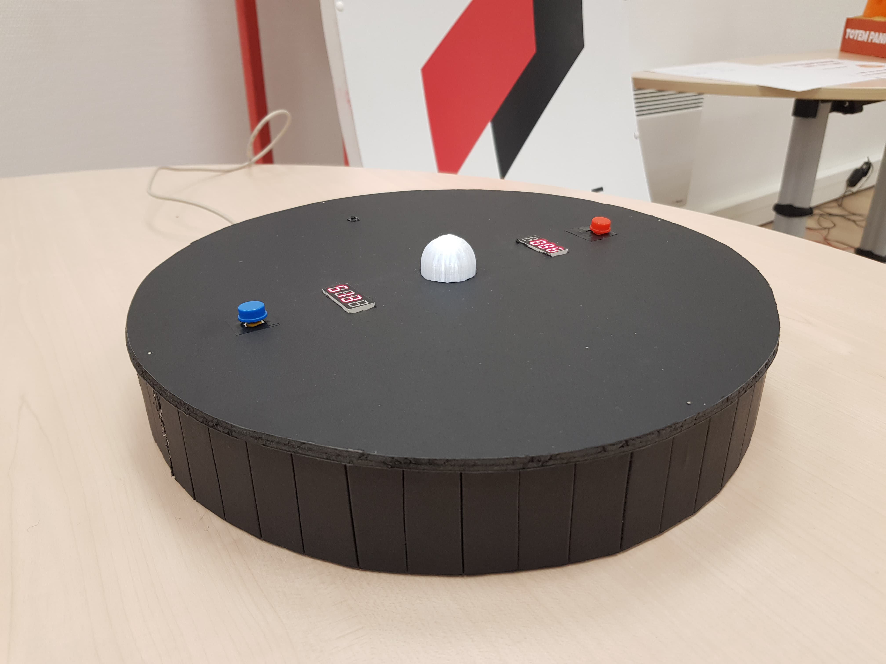

[**home**](../README.md)

# Bouton**LED**Bouton

## **Par Victor Pérouse & Alice Briolat**


---

## **CONTEXTE**

Dans le cadre du module de connectivité, il nous a été demandé de réaliser un jeu électronique. Nous devions réaliser un jeu correctement developpé mais avant tout avec un bon gameplay.

## **PRINCIPE DU JEU**

Une LED et deux boutons se joue à deux. Le jeu consiste à appuyez sur votre bouton au moment où l'intensité lumineuse de la LED centrale vous parait la plus forte.
Nous voulions réaliser un jeu à la fois simple mais rapidement addictif.

## **RÈGLES DU JEU**

- La LED centrale varie en intensité lumineuse de manière imprévisible.
- Vous avez à disposition un bouton et une écran chacun.
- Vous devez appuyez au moment où vous pensez que l'intensité lumineuse est la plus importante - sans limite de temps.
- Une fois que vous avez appuyé sur le bouton, votre score s'affiche de 0 à 1000. Le score le plus élevé remporte la partie. (On peut aussi imaginer que le vainqueur est le joueur le plus proche de 0 ou de 500 par exemple.)
- Plus qu'à comparer les chiffres !
- Et c'est reparti ! - Restart

---

## **MATÉRIEL UTILISÉ**

### **Composants électroniques**

- 1 LED
- 1 Carte Arduino
- 1 Breadboard
- 2 Boutons - Joueurs
- 1 Bouton - Restart
- 2 Afficheurs 7 segments - 4-Digits
- 3 Résistances de 10K Ohms
- Assez de Fils pour brancher tous les composants

### **Composants tangibles**

- Carton plume
- Pièce imprimé en 3D en plastique transparent (facultatif, à placer autour de la LED pour diffuser la lumière)
- Colle chaude
- Épingles
- Patafix

---

## **DÉROULEMENT DU PROJET**

Avant toute chose nous avons réfléchi au gameplay, nous voulions un jeu "Easy to learn, hard to master", qui puisse proposer suffisamment de challenge ou de frustration pour faire sourire tous les joueurs. Pour cela nous avons émis quelques propositions et finalement validé la piste de "la LED et du bouton" avec ce principe : appuyez sur votre bouton au moment où l'intensité lumineuse de la LED centrale vous parait la plus forte. Un jeu simple à concevoir et à appréhender puisque la seule interaction possible est d'appuyer sur un bouton. C'est là qu'est toute l'intelligence de notre jeu : Proposer un gameplay avec seulement ces deux éléments. 

Nous avons ensuite précisé notre intention en prévoyant un jeu où 2 joueurs s'affrontent autour de la LED. Evidement il a un vainqueur et un vaincu, nous avons choisi de déterminer cela par un score. Ce score est compris entre 0 et 1000 et s'affiche sur un afficheur à 4 chiffres au moment où le joueur presse son bouton.

Une fois ces règles fixées, nous avons commencé à coder. Au début pas de soucis, nous savions faire varier l'intensité lumineuse d'une LED et connecter un bouton. Par la suite l'aide de nos intervenants, que nous remercions beaucoup, nous a été précieuse. Ils nous ont par exemple aidé à faire clignoter la LED sans *delay* (pratique quand on veut lire l'état d'un bouton à n'importe quel moment !) ou à afficher proprement les scores sur les afficheurs à 4 chiffres.


Montage d'une LED et d'un bouton


Score affiché sur 2550 à l'appui du bouton et basé sur la luminosité de la LED - Prototype jouable ✅

Une fois le code terminé nous nous sommes lancé dans la réalisation de la maquette. Nous voulions que la forme suive le gameplay et soit des plus simples. Nous avons donc décidé de conserver l'idée d'avoir une LED unique et avons choisi de petits boutons qui invitent à cliquer et non pas de gros boutons que l'on aurait envie de frapper. Nous voulions couvrir la LED blanche d'une sorte d'abat-jour pour avoir une lumière plus diffuse et avons pour cela, utilisé une pièce imprimée en 3D, une sorte de cylindre avec une extrémité sphérique. Le plateau de jeu est rond et en carton plume noir, ce qui crée une forme d'harmonie entre lui et la LED en son centre. Nous avons terminé par coller les différents composants à la structure, câbler le tout et refermer le plateau de jeu à l'aide d'épingles !



Rendu final


Rendu final 

---

## CODE

Nous présentons ici le code commenté, étape par étape puis dans son entièreté.

### 1. Utilisation de la bibliothèque SevenSegmentTM1637

```c
    // On commence par incorporer la librairy pour utiliser les afficheurs à 4 digits
    #include <SevenSegmentFun.h>
    #include <SevenSegmentTM1637.h>
    #include <SevenSegmentExtended.h>
    
    
    // SevenSegmentTM1637 afficheur(BROCHE_CLK, BROCHE_DIO) pour conntecter les afficheurs;
    SevenSegmentTM1637 afficheur_joueur1(4, 5);
    SevenSegmentTM1637 afficheur_joueur2(6, 7);
```

### 2. Déclaration des variables, connexion du matériel
```c
    // On connecte la LED à la pin 9
    #define LED   9
    
    // On connecte les boutons de chaque joueur
    int pinBouton1 = 2;
    int pinBouton2 = 3;
    
    // On déclare 2 variables liées à l'intensité lumineuse de la LED
    float T = 0;
    float incr = 0.005;
    
    // On crée un bouleén pour chaque bouton , cela sert à lancer une fonction lorsque l'on presse le bouton 1 fois
    boolean bouton1Appui = false;
    boolean bouton2Appui = false;
    
    // On crée 2 variables de score, une pour chaque joueur et on les initialise à 0
    int scoreP1 = 0;
    int scoreP2 = 0;
```

### 3. Setup
```c
    void setup() {
    
    	// On renseigne les rôles des différentes pins et on démarre la communication avec le moniteur série
    	pinMode(pinBouton1, INPUT);
    	pinMode(pinBouton2, INPUT);
    	pinMode(LED, OUTPUT);
    	Serial.begin(9600);
    
    
    	// On initialise les afficheurs des 2 joueurs
    	afficheur_joueur1.begin();
    	afficheur_joueur1.setBacklight(100);
    	afficheur_joueur2.begin();
    	afficheur_joueur2.setBacklight(100);
    
    	// On utilise une randomSeed sur la pin A0 pour qu'elle capte une donnée naturelle et base sa génération de nombres aléatoires dessus 
    	// Cette ligne nous permet d'avoir une vraie notion d'aléatoire à chaque lancement du programme
    	randomSeed(analogRead(0));
    
    }
```

### 4. Luminosité de la LED

```c
    void loop() {
    
    	T  += incr;
    
    	// On fait varier l'intensité lumineuse grâce au sinus, sa courbe sinusoïdale permet d'avoir une variation de lumière progressive
    	double fadeValue = (sin(T) + 1 ) * 127;
    	analogWrite(LED, fadeValue);
    
    
    	// On change la valeur de la variation a chaque boucle = On change le rythme d'éclairage à chaque boucle
    	if (fadeValue < 1) {
    	incr = random(2, 100) / 100000.0;
    }
```

### 5. Affichage du score
```c
    	// On lit l'état des boutons de chaque joueur à chaque boucle
    	int etatBouton1 = digitalRead(pinBouton1);
    	int etatBouton2 = digitalRead(pinBouton2);
    
    	// On lance la boucle à l'instant où le bouton de joueur 1 est pressé
    	if (etatBouton1 == 1 && bouton1Appui == false) {
    		scoreP1 = round(fadeValue);   // Le score prend la valeur de la luminosité de la LED à l'instant T
    		scoreP1 = map(scoreP1, 0, 255, 0, 1001);    // On reporte ce chiffre pour avoir un score entre 0 et 1000
    		afficheur_joueur1.print(scoreP1);     // On affiche le score sur l'écran du joueur 1
    		bouton1Appui = true;      // On change la valeur de la variable : On ne peut pas changer son score, il faut donc relance une partie pour retenter sa chance
    	}
    
    	// Exactement la même fonction que le joueur 1, pour le joueur 2
    	if (etatBouton2 == 1 && bouton2Appui == false) {
    		scoreP2 = round(fadeValue);
    		scoreP2 = map(scoreP2, 0, 255, 0, 1001);
    		afficheur_joueur2.print(scoreP2);
    		bouton2Appui = true;
    	}
    
    }
```

### Code complet

```c
    // On commence par incorporer la librairy pour utiliser les afficheurs à 4 digits
    #include <SevenSegmentFun.h>
    #include <SevenSegmentTM1637.h>
    #include <SevenSegmentExtended.h>
    
    // SevenSegmentTM1637 afficheur(BROCHE_CLK, BROCHE_DIO) pour conntecter les afficheurs;
    SevenSegmentTM1637 afficheur_joueur1(4, 5);
    SevenSegmentTM1637 afficheur_joueur2(6, 7);
    
    // On connecte la LED à la pin 9
    #define LED   9
    
    // On connecte les boutons de chaque joueur
    int pinBouton1 = 3;
    int pinBouton2 = 2;
    
    // On déclare 2 variables liées à l'intensité lumineuse de la LED
    float T = 0;
    float incr = 0.005;
    
    // On crée un bouleén pour chaque bouton , cela sert à lancer une fonction lorsque l'on presse le bouton 1 fois
    boolean bouton1Appui = false;
    boolean bouton2Appui = false;
    
    // On crée 2 variables de score, une pour chaque joueur et on les initialise à 0
    int scoreP1 = 0;
    int scoreP2 = 0;
    
    
    void setup() {
    
    	// On renseigne les rôles des différentes pins et on démarre la communication avec le moniteur série
    	pinMode(pinBouton1, INPUT);
    	pinMode(pinBouton2, INPUT);
    	pinMode(LED, OUTPUT);
    	Serial.begin(9600);
    
    
    	// On initialise les afficheurs des 2 joueurs
    	afficheur_joueur1.begin();
    	afficheur_joueur1.setBacklight(100);
    	afficheur_joueur2.begin();
    	afficheur_joueur2.setBacklight(100);
    
    	// On utilise une randomSeed sur la pin A0 pour qu'elle capte une donnée naturelle et base sa génération de nombres aléatoires dessus 
    	// Cette ligne nous permet d'avoir une vraie notion d'aléatoire à chaque lancement du programme
    	randomSeed(analogRead(0));
    
    }
    
    
    void loop() {
    
    
    	T  += incr;
    
    	// On fait varier l'intensité lumineuse grâce au sinus, sa courbe sinusoïdale permet d'avoir une variation de lumière progressive
    	double fadeValue = (sin(T) + 1 ) * 127;
    	analogWrite(LED, fadeValue);
    
    
    	// On change la valeur de la variation a chaque boucle = On change le rythme d'éclairage à chaque boucle
    	if (fadeValue < 1) {
    		incr = random(2, 100) / 100000.0;
    	}
    
    	// On lit l'état des boutons de chaque joueur à chaque boucle
    	int etatBouton1 = digitalRead(pinBouton1);
    	int etatBouton2 = digitalRead(pinBouton2);
    
    	// On lance la boucle à l'instant où le bouton de joueur 1 est pressé
    	if (etatBouton1 == 1 && bouton1Appui == false) {
    		scoreP1 = round(fadeValue);   // Le score prend la valeur de la luminosité de la LED à l'instant T
    		scoreP1 = map(scoreP1, 0, 255, 0, 1001);    // On reporte ce chiffre pour avoir un score entre 0 et 1000
    		afficheur_joueur1.print(scoreP1);     // On affiche le score sur l'écran du joueur 1
    		bouton1Appui = true;      // On change la valeur de la variable : On ne peut pas changer son score, il faut donc relance une partie pour retenter sa chance
    	}
    
    	// Exactement la même fonction que le joueur 1, pour le joueur 2
    	if (etatBouton2 == 1 && bouton2Appui == false) {
    		scoreP2 = round(fadeValue);
    		scoreP2 = map(scoreP2, 0, 255, 0, 1001);
    		afficheur_joueur2.print(scoreP2);
    		bouton2Appui = true;
    	}
    
    }
```


## **ASSEMBLAGE**

### Schéma du montage électronique


### Montage du plateau de jeu


Plan coté du plateau de jeu


Schéma du plateau de jeu


Rendu final

---

C'est tout pour nous ! Nous espérons que tout est clair et que ce protocole vous permettra de recréer et de vous approprier notre jeu. N'hésitez pas à nous contacter si vous rencontrez des difficulté ou si vous voulez partager votre version du jeu avec nous :

a.briolat@lecolededesign.com

v.perouse@lecolededesign.com

Merci,

**Alice & Victor**

[**home**](../README.md)
