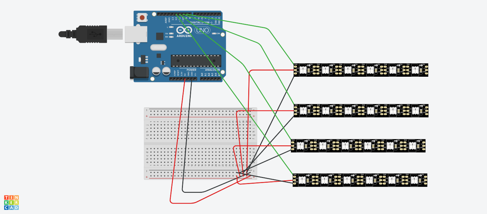
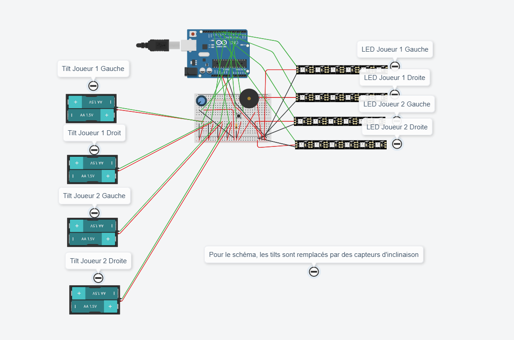
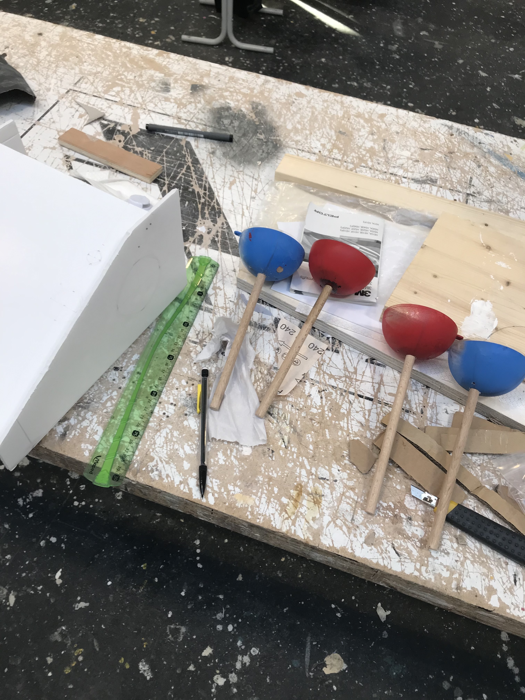
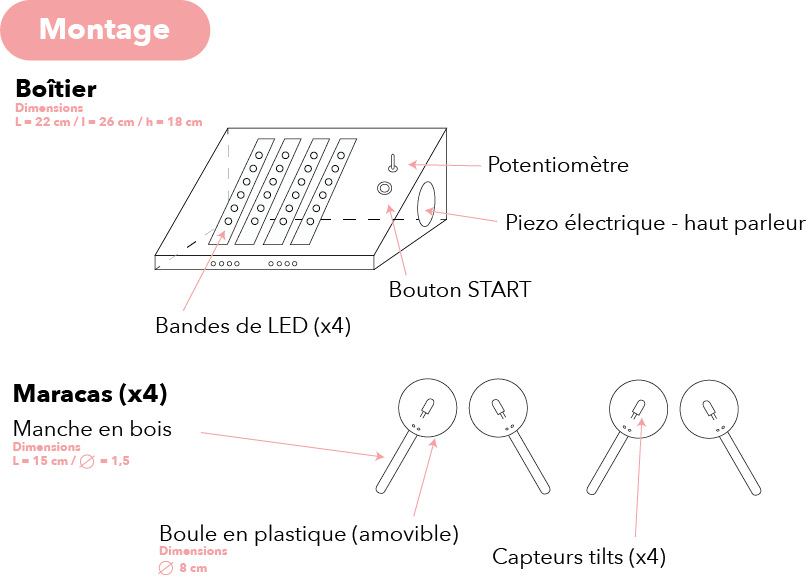

[**home**](../README.md)

# MaracaGame 🎼

##### Petit jeu électronique basé sur Arduino
###### Réalisé par Noémie El Kholti et Julie Thierry   

---

## Le principe 

A l'aide de deux maracas, deux joueurs collaborent pour reproduire les notes dans la zone de jeu. Inspiré des célèbres jeux vidéo de rythme Samba de Amigo (SEGA, 1999) et Guitar Hero (Activision, 2005), chaque ruban de LED est associé à une maraca. Le but est d'être réactif, pour ne pas manquer une note dans la zone de jeu. Si trop de fausses notes sont réalisées, alors la partie est finie. Trois niveaux de vitesse sont proposés sur une mélodie endiablée. 


##### Règles du jeu


---

## Quelques codes de test

Pour construire notre jeu, nous avons expérimenté différents codes. 
Afin de piloter les quatre rubans de LED, nous avons utilisé la bibliothèque NeoPixel, associée à FastLed. 

###### La bibliothèque NeoPixel

Concernant les rubans de LED, nous allons utiliser la bibliothèque [NeoPixel](https://learn.adafruit.com/adafruit-neopixel-uberguide/the-magic-of-neopixels). Sur son site elle y est largement documentée, avec des indications de montage et des explications concernant l'usage des bibliothèques. Elle est également disponible dans le gestionnaire des bibliothèques Arduino. Nous avons associé cette bibliothèque avec [FastLed](https://github.com/FastLED), une bibliothèque qui permet de controler et programmer rapidement les rubans de LED. 


#####  Le montage des rubans de LED :



##### Le code 


Tout d'abord, on inclut la  bibliothèque FastLED : 

```c
#include <FastLED.h>
```
On définit le nombre de LED, en l'occurence 6 : 
```c
#define NUM_LEDS 6
```
On inclut la bibliothèque pour [VirtualDelay](https://www.instructables.com/id/Non-blocking-Virtual-Delay-Library-for-the-Arduino/) qui permet de contourner le delay() d'Arduino, qui a tendance à être limité. La bibliothèque va permettre de définir un tableau de données où chaque entrée du tableau représentera une led : 

```c
#include "avdweb_VirtualDelay.h"
#include <Arduino.h>

VirtualDelay firstDelay;
int indexLed1 = 0;
CRGBArray<NUM_LEDS> leds1; 

VirtualDelay secondDelay;
int indexLed2 = 0;
CRGBArray<NUM_LEDS> leds2; 

VirtualDelay thirdDelay;
int indexLed3 = 0;
CRGBArray<NUM_LEDS> leds3; 

VirtualDelay fourthDelay;
int indexLed4 = 0;
CRGBArray<NUM_LEDS> leds4; 
```

Dans le ```setup()```, on initialise chaque strip de led sur la pin correspondante (exemple : la strip de led 1 correspond à la pin 9, la strip de led 2 à la pin 10 etc.) : 

```c
void setup() {
  Serial.begin(9600);
  FastLED.addLeds<NEOPIXEL, 9>(leds1, NUM_LEDS);
  FastLED.addLeds<NEOPIXEL, 10>(leds2, NUM_LEDS);
  FastLED.addLeds<NEOPIXEL, 11>(leds3, NUM_LEDS);
  FastLED.addLeds<NEOPIXEL, 12>(leds4, NUM_LEDS);

}
````
Dans le ```loop()```, on peut définir la vitesse et l'intensité lumineuse des LED, afin d'expérimenter leur contrôle : 

```c
void loop() {

  firstDelay.start(600);
  if (firstDelay.elapsed()) {
    indexLed1 ++;
    indexLed1 = indexLed1 % NUM_LEDS;
  }
  
  for (int i = 0 ; i < NUM_LEDS ; i++) {
    if (i == indexLed1) {
      leds1[i] = CRGB(255, 0, 0);
    }
    else {
      leds1[i] = CRGB(0, 0, 0);
    }
  }

  secondDelay.start(500);
  if (secondDelay.elapsed()) {
    indexLed2 ++;
    indexLed2 = indexLed2 % NUM_LEDS;
  }
  
  for (int i = 0 ; i < NUM_LEDS ; i++) {
    if (i == indexLed2) {
      leds2[i] = CRGB(255, 0, 0);
    }
    else {
      leds2[i] = CRGB(0, 0, 0);
    }
  }

  thirdDelay.start(400);
  if (thirdDelay.elapsed()) {
    indexLed3 ++;
    indexLed3 = indexLed3 % NUM_LEDS;
  }
  
  for (int i = 0 ; i < NUM_LEDS ; i++) {
    if (i == indexLed3) {
      leds3[i] = CRGB(255, 0, 0);
    }
    else {
      leds3[i] = CRGB(0, 0, 0);
    }
  }


 fourthDelay.start(200);
  if (fourthDelay.elapsed()) {
    indexLed4 ++;
    indexLed4 = indexLed4 % NUM_LEDS;
  }
  
  for (int i = 0 ; i < NUM_LEDS ; i++) {
    if (i == indexLed4) {
      leds4[i] = CRGB(255, 0, 0);
    }
    else {
      leds4[i] = CRGB(0, 0, 0);
    }
  }
FastLED.show();
}

//leds[i] = CRGB(255, 0, 0);
//FastLED.show(); // on actualise le ruban de led

}
```


---


## MaracaGame.ino

##### Le matériel
* 1 carte Arduino Uno 
* 1 bread board 
* 1 cable USB 
* 4 rubans de leds NeoPixel (24 leds)
* 4 tilts
* 1 potentiomètre 
* 1 bouton 
* 1 piezo électrique 
* 1 résistance 10ohm

##### Le montage électronique 




##### Le code 

```c
////
//13.02.2020 Julie THIERRY, Noemie El Kholti


//déclaration bibliothèque//
#include "avdweb_VirtualDelay.h"
#include <Arduino.h>
#include "pitches.h"
#include "melody.h"
#include <FastLED.h>


//déclaration bouton start //
int etat;
const int bouton = 7 ;
int boutonstart = 0;


//déclaration potentiometer //
const int potentiometer = A0 ;
int potomesure;


//déclaration tilt maracas//
int maracasJoueur1Gauche = LOW; // valeur initiale tilt/maracas Joueur 1 gauche
int maracasJoueur1Droite = LOW; // valeur initiale tilt/maracas Joueur 1 droite
int maracasJoueur2Gauche = LOW; // valeur initiale tilt/maracas Joueur 2 gauche
int maracasJoueur2Droite = LOW;// valeur initiale tilt/maracas Joueur 2 droite


//déclaration musique //
#define SIGNAL_PIN 6  // pin Piezo Electrique - Haut parleur  
VirtualDelay delay1; // delai de la musique 
int noteDuration = 100; // tempo de base de musique 
int noteIndex = 0; // on commence par la première note
float speedDivisor = 1.75; // varier le tempo de la musique en fonction du niveau 
bool noteOn = false; // évenement si les notes sont jouées // l'évenement est faux de base // 


//déclaration évenement de début// 
bool lightStarted = false; // évenement si les lumières sont jouées ou pas // initialisation faux, elles ne sont pas jouées pour le début
bool musicStarted = false; // évenement si la musique est jouée ou pas // initialisation faux, elle n'est pas jouée pour le début


//déclaration score //
int score = 1; // définir la valeur initiale du score 


//déclaration LEDS // 
#define NUM_LEDS 6 // définir le nombre de leds
VirtualDelay firstDelay; // delai pour le ruban de LED 1 // maracasJoueur1Gauche //
int indexLed1 = 0; // on part de la LED 0 (la première LED / la LED du haut)
CRGBArray<NUM_LEDS> leds1; //définir un tableau de données chaque entrée du tableau représentera une led. Pour le ruban 1

VirtualDelay secondDelay; // delai pour le ruban de LED 2 // maracasJoueur1Droite //
int indexLed2 = 0; // on part de la LED 0 (la première LED / la LED du haut)
CRGBArray<NUM_LEDS> leds2; //définir un tableau de données chaque entrée du tableau représentera une led. Pour le ruban 2

VirtualDelay thirdDelay; // delai pour le ruban de LED 3 // maracasJoueur2Gauche //
int indexLed3 = 0; // on part de la LED 0 (la première LED / la LED du haut)
CRGBArray<NUM_LEDS> leds3; //définir un tableau de données chaque entrée du tableau représentera une led. Pour le ruban 3

VirtualDelay fourthDelay; // delai pour le ruban de LED 4 // maracasJoueur2Droite //
int indexLed4 = 0;  // on part de la LED 0 (la première LED / la LED du haut)
CRGBArray<NUM_LEDS> leds4; //définir un tableau de données chaque entrée du tableau représentera une led. Pour le ruban 4

float tralala = 1000; // variation de vitesse du défilement des LEDs entre les différents rubans de LED. 


void setup() {

  pinMode(bouton, INPUT); // initialisation Bouton start 
  pinMode(potentiometer, INPUT); // initialisation Potentiomètre, niveau 
  etat = HIGH; // état du bouton 
  Serial.begin(9600);

  FastLED.addLeds<NEOPIXEL, 9>(leds1, NUM_LEDS); // LED joueur 1 gauche 
  FastLED.addLeds<NEOPIXEL, 10>(leds2, NUM_LEDS); // LED joueur 1 droite 
  FastLED.addLeds<NEOPIXEL, 11>(leds3, NUM_LEDS); // LED joueur 2 gauche 
  FastLED.addLeds<NEOPIXEL, 12>(leds4, NUM_LEDS); // LED joueur 2 droite 

  pinMode(2, INPUT_PULLUP); // Maracas joueur 1 gauche 
  pinMode(8, INPUT_PULLUP); // Maracas joueur 1 droite 
  pinMode(4, INPUT_PULLUP); // Maracas joueur 2 gauche 
  pinMode(13, INPUT_PULLUP); // Maracas joueur 2 droite 

}

void loop()
{
  //tilt // on lit les données des tilts // 
  maracasJoueur1Gauche = digitalRead(2);
  maracasJoueur1Droite = digitalRead(8);
  maracasJoueur2Gauche = digitalRead(4);
  maracasJoueur2Droite = digitalRead(13);
  //Serial.print("maracasJoueur1Gauche = ");
  //Serial.println(maracasJoueur1Gauche);
  //Serial.print("maracasJoueur1Droite = ");
  //Serial.println(maracasJoueur1Droite);
  //Serial.print("maracasJoueur2Gauche = ");
  //Serial.println(maracasJoueur2Gauche);
  //Serial.print("maracasJoueur2Droite ");
  //Serial.println(maracasJoueur2Droite);


  // gérer la mélodie sans délais // 
  delay1.start(noteDuration / speedDivisor); // on definit la valeur du delai en fonction de noteDuration, tempo de la musique, et speedDivisor, la variation du tempo // 
  if (delay1.elapsed()) // si le delai est écoulé
  {
    if (noteOn) { // on joue les notes
      noteIndex += 1; // on passe à la note suivant 
      int noteCount = sizeof(melody) / sizeof(int) - 1;
      noteIndex = noteIndex % noteCount;
      noteOn = false;
    }
    else {
      noteOn = true;
    }
  }


  // jouer la mélodie
  if (musicStarted == true) { // lorsque musicStarted est vrai, quand la valeur du potentiomètre lit un niveau, on joue la mélodie // lorsque vous avez sélectionné un niveau, la musique est jouée
    playMelody1();

  }

  
  // jouer les lumières et les maracas// 
  if (lightStarted == true) { // lorsque lightStarted est vrai, quand la valeur du potentiomètre lit un niveau, les LEDS s'allument et défilent, et les tilts des maracas lisent des valeurs// lorsque vous avez sélectionné un niveau, les LEDS se lancent, vous avez à bouger les maracas, le score comme à descendre, le jeu commence 
    playLights();
    tilt();

  }

  
  // définir le debut de partie et gérer la difficulté (difficulté = niveau) // fonction des iveau de difficulté 
  interaction();

  

}


void interaction() {

  potomesure = analogRead(A0); // initialisation du potentiomètre
  etat = digitalRead(bouton);
  // Serial.println(etat);


  if (etat == HIGH) { // le bouton est appuyé

    //Serial.print("potomesure = ");
    //Serial.println(potomesure);
    //Serial.print("etat = ");
    //Serial.println(etat);
    int difficulty = map(potomesure, 0, 1023, 0, 3); // Le niveau est relié à la valeur du potentiomètre 
    //Serial.println(difficulty);

    if (difficulty > 0) { // lorsque la difficulté est supérieur à 0 donc lorsqu'on est au moins niveau 1 
      musicStarted = true; // la musique est lue
      noteIndex = 0; // on commence par la première note
      lightStarted = true; //les lumièrses et les tils sont allumés  
      if (difficulty == 1) { // paramètre niveau 1
        speedDivisor = 1;  // la vitesse de la musique est normale
        tralala = 200; // la vitesse de défilement des LEDs est faible
      }
      else  if (difficulty == 2) {// paramètre niveau 2
        speedDivisor = 3; // la vitesse de la musique est moyenne
        tralala = 100; // la vitesse de défilement des LEDs est moyenne
      }
      else  if (difficulty == 3) {// paramètre niveau 3
        speedDivisor = 7; // la vitesse de la musique est grande 
        tralala = 40; // la vitesse de défilement des LEDs est forte
      }
    } else { // rien ne se passe si le potentiomètre a pour valeur 0 
      musicStarted = false; // la musique n'est pas jouée
      noteIndex = 0;  // la musique est réinitiliasée 
      lightStarted = false; // les lumières sont éteintes et les tilts ne lisent pas de valeur 
 
    }
  }
}


void playMelody1() { // Joueur la mélodie 
  int noteCount = sizeof(melody) / sizeof(int) - 1;
  int bpm = melody[0];

  noteDuration = 60000 * 4.0 / bpm / melody[noteIndex + 2];

  if (noteOn) {
    tone(SIGNAL_PIN, melody[noteIndex + 1], noteDuration);
  }
  else {
    noTone(SIGNAL_PIN);
  }

}

void playLights() {


  // Rythme LED joueur 1 gauche // 
  firstDelay.start(tralala * 1.75); // le ruban de LED a son propre rythme de défilement 
  if (firstDelay.elapsed()) { // le délai est écoulé 
    indexLed1 ++; // la LED suivante s'allume 
    indexLed1 = indexLed1 % NUM_LEDS;
  }

  for (int i = 0 ; i < NUM_LEDS ; i++) {
    if (i == indexLed1) {
      leds1[i] = CRGB(0, 0, 255);// La LED allumé est bleu
      leds1[5] = CRGB(255, 0, 0); //La dernière sera toujours rouge
    }
    else {
      leds1[i] = CRGB(0, 0, 0); // aucune LED ne l'allume
    }
  }


  //Rythme LED joueur 1 droite
  secondDelay.start(tralala * 2); // le ruban de LED a son propre rythme de défilement 
  if (secondDelay.elapsed()) { // le delai est écoulé 
    indexLed2 ++;  // la LED suivante s'allume 
    indexLed2 = indexLed2 % NUM_LEDS;
  }

  for (int i = 0 ; i < NUM_LEDS ; i++) {
    if (i == indexLed2) {
      leds2[i] = CRGB(0, 0, 255); // La LED allumé est bleu
      leds2[5] = CRGB(255, 0, 0); //La dernière sera toujours rouge
    }
    else {
      leds2[i] = CRGB(0, 0, 0);  // aucune LED ne l'allume
    }
  }


  //Rythme LED joueur 2 gauche//
  thirdDelay.start(tralala * 1.5); // le ruban de LED a son propre rythme de défilement 
  if (thirdDelay.elapsed()) { // le delai est écoulé 
    indexLed3 ++;  // la LED suivante s'allume 
    indexLed3 = indexLed3 % NUM_LEDS;
  }

  for (int i = 0 ; i < NUM_LEDS ; i++) {
    if (i == indexLed3) {
      leds3[i] = CRGB(0, 0, 255); // La LED allumé est bleu
      leds3[5] = CRGB(255, 0, 0); //La dernière sera toujours rouge
    }
    else {
      leds3[i] = CRGB(0, 0, 0); // aucune LED ne l'allume
    }
  }


  // Rythme LED joueur 2 droite //
  fourthDelay.start(tralala * 2.5); // le ruban de LED a son propre rythme de défilement 
  if (fourthDelay.elapsed()) { // le delai est écoulé 
    indexLed4 ++;  // la LED suivante s'allume 
    indexLed4 = indexLed4 % NUM_LEDS;
  }

  for (int i = 0 ; i < NUM_LEDS ; i++) {
    if (i == indexLed4) {
      leds4[i] = CRGB(0, 0, 255); // La LED allumé est bleu
      leds4[5] = CRGB(255, 0, 0); // La dernière sera toujours rouge
    }

    else {
      leds4[i] = CRGB(0, 0, 0); // aucune LED ne l'allume
    }
  }

  FastLED.show();
}

void tilt() {
//Serial.print("score : ");
//Serial.println(score);

  if (indexLed1 == 5) {
    if (maracasJoueur1Gauche == HIGH) {
      //Serial.println("J 1 G ++");
      score = score;  // le score ne change pas si le tilt/Maracas du Joueur 1 gauche est HIGH (secouer pour qu'il soit HIGH) au moment au la cinquième LED du ruban de LED correspondant au Joueur 1 gauche est rouge
    } else {
      score = score + 1; //le score augmente si le tilt/Maracas du Joueur 1 gauche est LOW au moment au la cinquième LED du ruban de LED correspondant au Joueur 1 gauche est rouge
    }
  }

  if (indexLed2 == 5) {
    if (maracasJoueur1Droite == HIGH) {
     // Serial.println("J 1 D --");
      score = score;  // le score ne change pas si le tilt/Maracas du Joueur 1 droit est HIGH (secouer pour qu'il soit HIGH) au moment au la cinquième LED du ruban de LED correspondant au Joueur 1 droit est rouge
    } else {
      score = score + 1; //le score augmente si le tilt/Maracas du Joueur 1 droit est LOW au moment au la cinquième LED du ruban de LED correspondant au Joueur 1 droit est rouge
    }
  }

  if (indexLed3 == 5) {
    if (maracasJoueur2Gauche == HIGH) {
      //Serial.println("J 2 G ++");
      score = score; // le score ne change pas si le tilt/Maracas du Joueur 2 gauche est HIGH (secouer pour qu'il soit HIGH) au moment au la cinquième LED du ruban de LED correspondant au Joueur 2 gauche est rouge
    } else {
      score = score + 1; //le score augmente si le tilt/Maracas du Joueur 2 gauche est LOW au moment au la cinquième LED du ruban de LED correspondant au Joueur 2 gauche est rouge
    }
  }

  if (indexLed4 == 5) {
    if (maracasJoueur2Droite == HIGH) {
     // Serial.println("J 2 D --");
      score = score; // le score ne change pas si le tilt/Maracas du Joueur 2 droit est HIGH (secouer pour qu'il soit HIGH) au moment au la cinquième LED du ruban de LED correspondant au Joueur 2 droit est rouge
    } else {
      score = score + 1; //le score augmente si le tilt/Maracas du Joueur 2 droit est LOW au moment au la cinquième LED du ruban de LED correspondant au Joueur 2 droit est rouge 
    }
  }

  if (score >= 300) { // on perd lorsque le score est égale ou supérieur à 300
    for (int i = 0 ; i < NUM_LEDS ; i++) {
      leds1[i] = CRGB(255, 0, 0); // Les LEDS sont toutes rouges lorsqu'on a perdu 
      leds2[i] = CRGB(255, 0, 0);
      leds3[i] = CRGB(255, 0, 0);
      leds4[i] = CRGB(255, 0, 0);
    }
    FastLED.show();
    musicStarted = false; // la musique s'arrête 
    lightStarted = false; // La lumière s'éteint et les tilts/maracas ne lisent plus de valeur
    delay(2000); // délai avant de rejouer

    score = 0; // Le score est réinitialisé à 0


  }

}
```


##### Notice de montage




[**home**](../README.md)