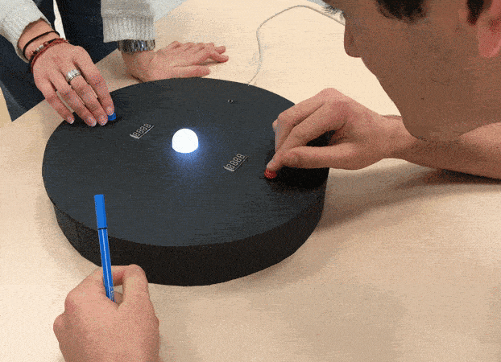
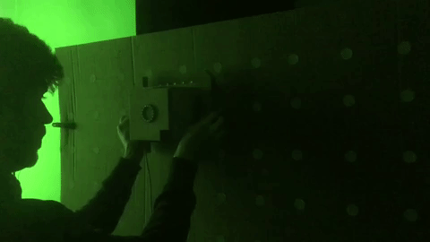

# projet_jeu_electronique_1920

[Code and documentation](https://github.com/AtelierNum/projet_jeu_electronique_1920) for the electronic game project by interaction students @lecolededesign.

Files can be found on [github](https://github.com/AtelierNum/projet_jeu_electronique_1920)

[Code et documentation](https://github.com/AtelierNum/projet_jeu_electronique_1920) pour le projet jeu éléctronique réalisé par les étudiants en design d'interaction.@lecolededesign. Ce projet est réalisé à l'aide d'arduino.

Les fichiers peuvent-être téléchargés sur [github](https://github.com/AtelierNum/projet_jeu_electronique_1920)

---
## Boutons Musicaux par Aurélien Colloc, Léa Ganais et Meriem Gharbi

Les boutons musicaux est un jeu électronique inspiré des chaises musicales.

Nous vous proposons une revisite, de l'illustre jeu de la chaise musicale.

Comme dans le jeu original, il y a une musique qui guide les joueurs. Toutefois, à la place des chaises on met des boutons. Et on utilise des Leds pour guider les joueurs entre les manches.

Le jeu est composé d’un boîtier central auquel sont reliés des boutons

(4 exactement). Il y a une succession de tours/manches et à l’issue de celles-ci un des joueurs est éliminé.

Dans notre exemple, il y a 4 participants et donc 3 manches pour éliminer 3 joueurs et déterminer le gagnant puisqu’il faut être le dernier pour remporter la partie.

Pour être le vainqueur, il faut être le plus rapide à presser le bouton à l'arrêt de la musique et de l’animation lumineuse.

Le dernier à appuyer sur le bouton est éliminé et doit attendre la fin de partie pour recommencer.

A noter, à chaques éliminations le jeu indique grâce aux LED qui est éliminé.

La documentation est disponible [ici](Boutons_musicaux/jeu.md)

---
## Kaboum par Juliette Herlem et Paul Joly

La base adverse vous attaque mais vous n'allez pas vous laisser faire ! Pour survivre à cette guerre, un seul moyen : **défendre votre base** et attaquer l'ennemi. 

Vous avez deux solutions : utiliser la force pure en envoyant des **bombes rouges** tout droit vers l’ennemi, ou bien utiliser la **magie verte** pour les affaiblir.

Quand deux bombes de même couleur se rencontrent (la vôtre et celle de votre adversaire), cela crée une explosion et elles disparaissent toutes deux. 
**Plus une explosion est proche de votre base, plus vous subissez de dégâts**.
Répondre à la bonne couleur et au bon moment est donc indispensable à votre survie. 
> Si votre adversaire vous envoie une bombe rouge, appuyer rapidement sur le bouton rouge. Faites de même pour les sorts de magie verte.

Vous pouvez toujours voir **vos points sur l'afficheur** devant vous. Attention, s'ils descendent à 0, vous avez perdu ! 
> Une fois la partie terminée, les afficheurs se remettent à 200 points et la partie recommence ! 

Profitez d'un moment d'inadvertance de votre ennemi pour **attaquer sa base directement**.
> Une attaque rouge ou verte qui va jusqu’à la base ennemie, sans se faire toucher par une bombe de même couleur : c'est beaucoup plus de points de gagnés !

La documentation est disponible [ici](Kaboum/Notice_de_montage.md)

---
## La guitare pour les héros par Allan Guégan et Simon Heurtebise

Détruisez les tuiles lumineuses ! 
Pour cela, il faut appuyer sur les boutons attitrés quand la tuile correspondante dépasse la zone claire. 
La vitesse augmente tout au long du jeu.

Vous êtes éliminé si vous appuyez trop tôt, c’est à dire avant que la led de tête n’arrive entièrement dans la zone claire. N’appuyez pas trop tard non plus, appuyez avant que la tuile lumineuse disparaisse. 

Le nombre de points augmentent par temps de pression. Plus vous appuyez longtemps, plus vous remportez des points. Attention à ne pas rester 
appuyer trop longtemps, vous risquez de perdre la partie.

La documentation est disponible [ici](La_Guitare_pour_les_heros/Documentation.md)

---
## bouton-LED-bouton par Victor Pérouse & Alice Briolat

Une LED et deux boutons se joue à deux. Le jeu consiste à appuyez sur votre bouton au moment où l'intensité lumineuse de la LED centrale vous parait la plus forte. Nous voulions réaliser un jeu à la fois simple mais rapidement addictif.

La LED centrale varie en intensité lumineuse de manière imprévisible.

Vous avez à disposition un bouton et une écran chacun.
Vous devez appuyez au moment où vous pensez que l'intensité lumineuse est la plus importante - sans limite de temps.

Une fois que vous avez appuyé sur le bouton, votre score s'affiche de 0 à 1000. Le score le plus élevé remporte la partie. (On peut aussi imaginer que le vainqueur est le joueur le plus proche de 0 ou de 500 par exemple.)

Plus qu'à comparer les chiffres !
Et c'est reparti ! - Restart

La documentation est disponible [ici](Led_Button/Readme.md)

---
## MaracaGame 🎼 par Noémie El Kholti et Julie Thierry   

A l'aide de deux maracas, deux joueurs collaborent pour reproduire les notes dans la zone de jeu. Inspiré des célèbres jeux vidéo de rythme Samba de Amigo (SEGA, 1999) et Guitar Hero (Activision, 2005), chaque ruban de LED est associé à une maraca. Le but est d'être réactif, pour ne pas manquer une note dans la zone de jeu. Si trop de fausses notes sont réalisées, alors la partie est finie. Trois niveaux de vitesse sont proposés sur une mélodie endiablée. 

La documentation est disponible [ici](Maraca_game/readme.md)

---
## SoNAR par Arslan Sifaoui et Ulysse Ducamp

SoNAR est un jeu électronique faisant appel à l'écoute et à la concentration de son utilisateur.

Le jeu se compose d'un boîtier dont la forme évoque un véhicule sous-marin et d'une planche en carton faisant office de carte dans laquelle on doit déplacer le boîtier. 

Sur la planche sont disposés des stickers RFID. Le sous-marin est doté d'un capteur de puces RFID, cela lui permet de savoir où il se situe sur la carte en fonction des puces qu'il capte. 

Le but du jeu est de positionner le sous-marin sur une puce mystère qui est déterminée aléatoirement. Pour que l'utilisateur puisse trouver la puce mystère, le sous-marin est équipé d'un sonar, un système qui émet un son plus ou moins rythmé en fonction d'à quel la point la puce qu'il capte est éloignée ou proche de la puce mystère. Cette mécanique de jeu "Chaud/Froid" permet à l'usager de déplacer le sous-marin en fonction des sons qu'il entend pour trouver la puce mystère. 

Lorsque le sous-marin capte la puce mystère, ses lumières gagnent en intensité et son anneau voit une de ses 16 LEDs s'allumer. Une nouvelle puce mystère est alors déterminée, toujours aléatoirement. L'utilisateur devra ainsi trouver 16 puces mystères afin d'allumer les 16 LEDs de l'anneau.

La documentation est disponible [ici](SoNAR/SoNAR.md)

---
## Speed Colors par Marie Jollivet et Clara Mahé

Des couleurs s'affiche sur une écran, il faut appuyer sur la couleur correspondante.

Speedcolors est un jeu à deux joueurs. Chaque joueur possède trois boutons, chaque bouton est associé à un LED colorée.

A chaque tour, les joueurs doivent appuyer sur le bouton correspondant à la LED affichant la même couleur que celle affichée sur le ruban principal.

Le jeu continu jusqu'à ce qu'un des joueurs se trompe et perde la partie. Le ruban de LED du joueur perdant s'affiche en rouge et celui du gagnant en blanc.

Un joueur perd, son ecran lumineux s'affiche en rouge à contrario un joueur gagne, son ecran lumineux s'affiche en blanc

Le temps est depassé, les joueurs n'ont pas joué à temps.

La documentation est disponible [ici](Speed_Colors/readme.md)

---
## Tape Mouche par Marie Sandevoir

Le jeu de la taupe est un jeu d'arcade dont le but est de taper, à l'aide d'un maillet, les taupes sortant de la borne d'arcade. Les taupes sortent de la borne de manière totalement aléatoire. L'objectif étant d'en taper le plus possible dans un temps limité.

Ici, le tape mouche est une déclinaison du tape taupe. En effet, au lieu de taper sur des taupes, le joueur tapera sur des mouches à l'aide d'une tapette à mouche.

La documentation est disponible [ici](Tape_Mouche/readme.md)

---
## Totem Panic par [Théo Geiller](theogeiller.com) and [Raphaël Perraud](raphaelperraud.com)

Natives are processing a ritual in order that their departed will be able to go to the Nirvana, but the totem gone crazy! Will you achieve to help them and stay on air until the end of the ritual?
According to the duration the player keeps the soul ball on air, and he will get a shaman rank, from "élan tranquille" to "aigle noir". 

> For now, no one went further than "plume tranquille", we still are waiting for great shamans !

The player can start a game by placing his hand upon the shaman on the right of the board game, and control the soul ball by raising or lowering his hand upon it.

La documentation est disponible [ici](Totem_Panic/README.md)

---
## Touch Me par Aurore Tanguy et Hugo Prévost

- **1** Le jeu consiste, en premier, à enfiler le gilet.
- **2** Une zone va s’activer à l’aide d’un vibreur et d’une led, qui s’enclenchent en même temps. L’objectif est de stimuler le sens du toucher et de la vue.
- **3** Le but : toucher la zone le plus rapidement possible avant qu’elle ne s’arrête de vibrer.
- **4** Une fois touchée, la zone va changer de place et ainsi de suite.

Pour ajouter du gameplay à notre jeu, nous avons choisi de donner trois vies à l’utilisateur. Si l’utilisateur se trompe de zone, il perd une vie. Et s’il prend trop de temps pour toucher la zone, il perd une vie. Plus l’utilisateur va avancer dans les niveaux, plus le temps d’activation de la zone sera courte. Quand l’utilisateur perds toutes ses vies, la partie est finie. Alors bon courage pour déjouer la stratégie de TouchMe. À vous de jouer.

La documentation est disponible [ici](Touch_Me/documentation.md)

---
## Tron run par Elliot Chevalier et Ronan Chopineaux

Tron race est un jeu de type arcade fonction sous arduino, monté initialement sur une carte arduino UNO.

Le jeu reprend l'idée et l'univers des courses de motos de la célèbre saga ***Tron***.

Le gameplay est simple et intuitif : à chaque pression sur le bouton correspondant à votre couleur de joueur, votre LED avance d'une unité. Ainsi, pour gagner la course et faire s'illuminer le circuit de votre couleur il faudra être plus rapide que votre adversaire.

À vous de jouer, bonne chance !

La documentation est disponible [ici](Tron_Run/TronRace.md)

---
## Witching Hour par Jeanne Verstraete et Emilie Schaefer

A travers le trou de la serrure d'une chambre d'enfant, on peut observer un petit garçon dormir dans son lit, sa chambre étant éclairée par le faible halo de lumière diffusé par une étrange lampe. Pendant la nuit, des monstres s'invitent dans la chambre et viennent infiltrer de terribles cauchemars dans les rêves du petit garçon. Le rôle du joueur est de chasser ces monstres le plus longtemps possible de la chambre de l'enfant, afin de protéger son sommeil. 

La documentation est disponible [ici](Witching_Hour/README.md)

[**home**](../README.md)