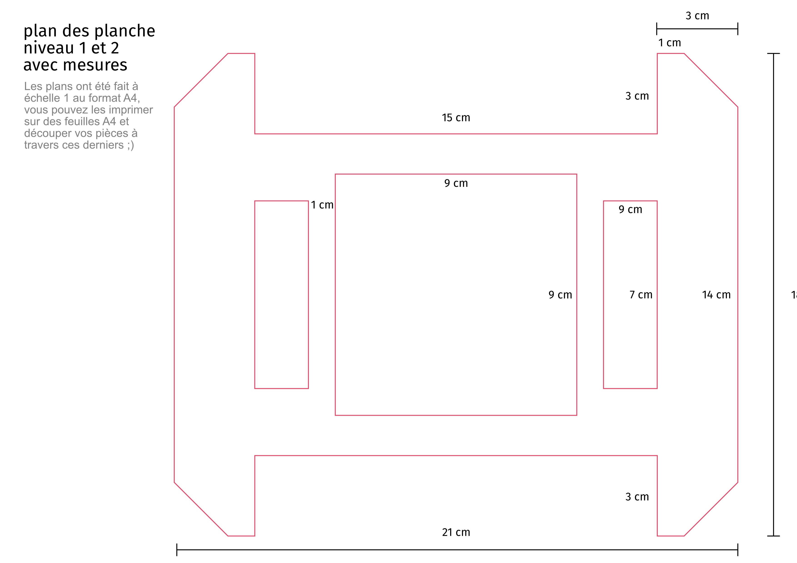

[**home**](../README.md)

# SoNAR

Réalisé par Arslan SIFAOUI et Ulysse DUCAMP - I3A

## Le fonctionnement de SoNAR

SoNAR est un jeu électronique faisant appel à l'écoute et à la concentration de son utilisateur.

Le jeu se compose d'un boîtier dont la forme évoque un véhicule sous-marin et d'une planche en carton faisant office de carte dans laquelle on doit déplacer le boîtier. 

Sur la planche sont disposés des stickers RFID. Le sous-marin est doté d'un capteur de puces RFID, cela lui permet de savoir où il se situe sur la carte en fonction des puces qu'il capte. 

Le but du jeu est de positionner le sous-marin sur une puce mystère qui est déterminée aléatoirement. Pour que l'utilisateur puisse trouver la puce mystère, le sous-marin est équipé d'un sonar, un système qui émet un son plus ou moins rythmé en fonction d'à quel la point la puce qu'il capte est éloignée ou proche de la puce mystère. Cette mécanique de jeu "Chaud/Froid" permet à l'usager de déplacer le sous-marin en fonction des sons qu'il entend pour trouver la puce mystère. 

Lorsque le sous-marin capte la puce mystère, ses lumières gagnent en intensité et son anneau voit une de ses 16 LEDs s'allumer. Une nouvelle puce mystère est alors déterminée, toujours aléatoirement. L'utilisateur devra ainsi trouver 16 puces mystères afin d'allumer les 16 LEDs de l'anneau.

## Notice de montage

### Matériel

#### Composants éléctronique

- une carte arduino uno
- un piezo buzzer
- une petite batterie externe
- un capteur rfid
- des câbles
- des leds UV
- un anneau de led RGB
- 70 stickers RFID
- une breadboard

#### Outils

- un cutter, une règle et un crayon/stylo
- du carton, beaucoup de carton !
- de la colle (nous avons utilisé un pistolet à colle)

#### Bonus

- Matériel pour souder (pour que l'assemblage des composants soit plus robuste)

### Réalisation du sous-marin

#### structure en carton

Nous avons conçu notre jeu en utilisant du carton comme matière première pour que sa fabrication soit plus ludique. Le carton est un matériaux facile à trouver, facile à travailler et peu coûteux. 

La première étape consiste à découper les planches qui vont former notre maquette à l'aide d'un cutter: 

Voici les plans avec les mesures des différents éléments à découper. Nous avons réalisé les plans au format A4 échelle 1 ce qui veut dire qu'il vous suffit d'imprimer chaque plan sur une feuille A4 pour ensuite pouvoir découper les éléments directement à travers les plans imprimé. 

Pour la planche du niveau 0, les deux rectangles au centre ne sont pas à découper totalement mais à creuser. Ces trous sont conçus pour permettre à la maquette d'accueillir au mieux les composants électroniques du jeu. Le carton que nous avons utilisé était composé de deux couches, pour réaliser les trous il nous a suffit de creuser la surface à l'aide d'un cutter en nous arrêtant à la première couche (voir le bas du visuel ci-dessous). 

Vous pouvez maintenant vous fier au visuel ci-dessus pour procéder à l'assemblage des éléments en carton. Nous vous conseillons de coller les 3 planches entre elles et d'enfoncer les facettes du boîtier dans le trou carré pour ne pas avoir à les coller et ainsi garder une certaine agilité dans votre montage. 

#### Intégration de l'éléctronique

Voici le schéma de câblage de nos composants électroniques, il faudra aussi intégrer la batterie externe qui permettra au sous-marin d'être autonome.

Ci-dessous deux photos pour vous vous montrer comment nous avons agencé les éléments. 

les deux trous précédemment effectués permettent de loger le capteur RFID et les LEDs. Nous avons planté les LEDs directement dans l'épaisseur de la planche du niveau 0, le trou permet ensuite de récupérer leurs tiges pour les relier au reste du système. Nous les avons soudé et scotché pour plus de stabilité. 

Nous avons également réalisé un trou dans le couvercle et un trou dans l'une des facettes du boîtier pour faciliter le passage du câble qui connecte la carte Arduino à la batterie. 

Pour pouvoir ouvrir et fermer le couvercle nous avons utilisé un système de scratch, vous pouvez utiliser d'autres systèmes en fonction de ce que vous avez à disposition par exemple de la patafix, du scotch, des cure-dents ou même un élastique. 

### Réalisation de la carte (matrice du puces RFID)

la réalisation de la carte demande patience et rigueur, pour la réaliser nous avons récupéré une grande planche en carton. 

Nous y avons collé 100 puces mais nous nous sommes rendus compte par la suite que la carte Arduino Uno ne pouvait pas fonctionner correctement avec autant de puces à enregistrer, nous nous sommes finalement contentés d'une matrice de 70 puces. Voici la grille à dessiner sur la planche pour pouvoir y coller les puces/stickers RFID avec précision. 

**remarque :** si vous n'avez pas de planche suffisamment grande, vous pouvez aussi réduire l'écart entre chaque puce, cela ne devrait pas poser de problème particulier tant qu'elles gardent au moins 2 ou 3 centimètres d'écarts entre elles. 

Il faudra ensuite coller une puce sur chacune des intersections de la grille comme ci-dessous : 

La maquette est maintenant terminée nous allons bientôt nous attaquer au programme qui fait fonctionner SoNAR. Avant cela il faut lister les 70 puces de sorte à pouvoir les noter dans notre programme. Il faudra les lister dans un certain ordre pour permettre au sous-marin de se situer par rapport à la carte en fonction des puces qu'il captera. 

Pour ce faire nous avons écrit un code qui permet d'écrire automatiquement le nom de chaque puces en ayant seulement à poser le capteur RFID au-dessus pour que notre code écrive son nom. 

Le nom du fichier contenant le code est : "generateur_de_tableau_de_puces_RFID"

Il faut donc passer le capteur sur chacune des puces de droite à gauche et de bas en haut en revenant à la ligne à chaque fois qu'on en termine une. Notre programme utilise un système de tableau dit "array" qui permet de créer des listes d'éléments et de les appeler en utilisant des nombres, le nombre du premier élément de la liste étant "0", la première puce de notre liste sera donc la puce numéro "0" et la dernière puce, la puce numéro "69". 

Nous vous laissons découvrir par vous-même le code que nous avons soigneusement commenté. 

Le nom du fichier contenant le code est : "SoNAR-code_arduino_commente"

Il faudra y changer la liste des 70 puces RFID en y mettant celle que vous aurez créé à l'aide du précédent code pour que votre jeu puissent fonctionner. Vous n'aurez ensuite plus qu'à téléverser le code sur votre carte Arduino pour pouvoir jouer. 

En vous souhaitant de belles parties, 

Arslan Sifaoui, Ulysse Ducamp, étudiants de l'École de design Nantes Atlantique.

[**home**](../README.md)