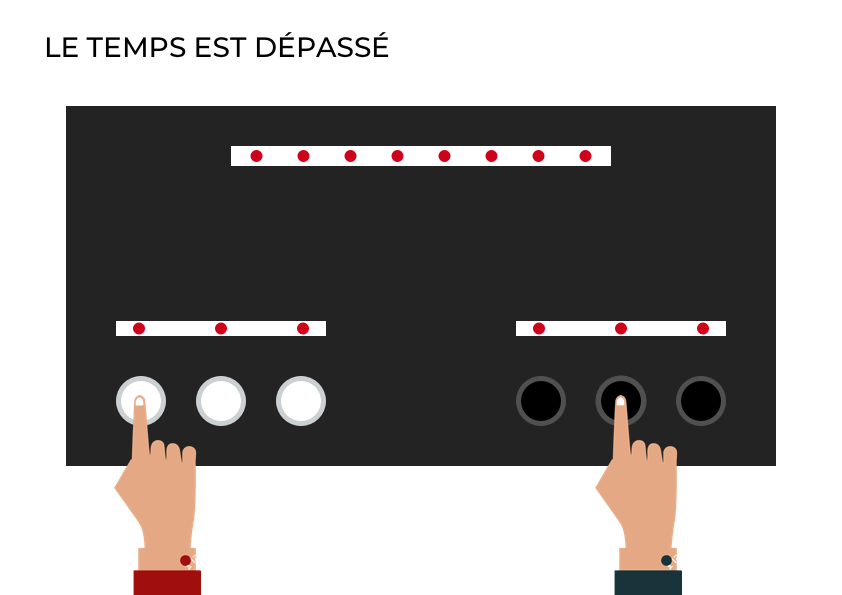
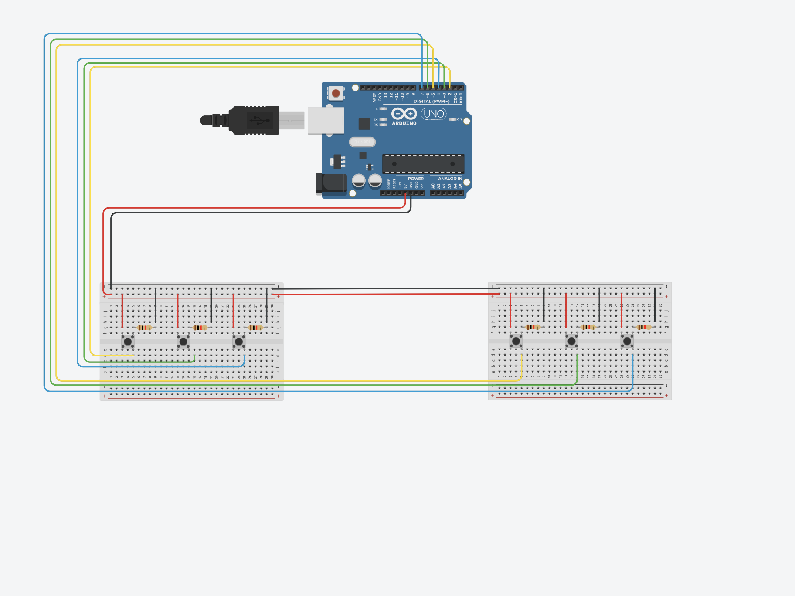

[**home**](../README.md)

# DOCUMENTATION PROJET ARDUINO : SPEEDCOLORS

## Présentation du projet : SPEEDCOLORS 
Dans le cadre de notre projet Arduino, nous avons réalisé un jeu interactif, Le Speedcolors. 
Pour réaliser ce jeu, nous nous sommes basées sur le principe du Twister. Speedcolors va jouer avec votre patience et votre vision. 

 


## Principe et règle du jeu 

### Principe du jeu :

Des couleurs s'affiche sur une écran, il faut appuyer sur la couleur correspondante.


### Règle du jeu :

Speedcolors est un jeu à deux joueurs. Chaque joueur possède trois boutons, chaque bouton est associé à un LED colorée. 

A chaque tour, les joueurs doivent appuyer sur le bouton correspondant à la LED affichant la même couleur que celle affichée sur le ruban principal. 

Le jeu continu jusqu'à ce qu'un des joueurs se trompe et perde la partie. Le ruban de LED du joueur perdant s'affiche en rouge et celui du gagnant en blanc. 


Un joueur perd, son ecran lumineux s'affiche en rouge à contrario un joueur gagne, son ecran lumineux s'affiche en blanc


Le temps est depassé, les joueurs n'ont pas joué à temps.



## Matériels utilisées  

Voici une liste du matériel utilisé

    -Une carte Arduino
    -Deux BreadBoard
    -Deux rubans de cinq LED
    -Un ruban de huit LED
    -Sept boutons poussoirs
    -Six résistance 10k
    -Câbles
    -Rallonges de câbles 
    -Alimentation électrique ou USB pour la carte Arduino
    -Deux planches de 72/30 cm
    -Deux planches de 72/14 cm
    -Deux planches de 30/14cm

## Couleurs random

Il faut choisir 9 couleurs, le ruban de Led était un GRB. Cependant les couleurs ci-dessous sont en RVB car cela est retraduit directement dans le code.

R:133 V:6 B:6 = Rouge sang

R:255 V:125 B:0 = Jaune

R:255 V:0 B:255 = Rose

R:105 V:24 B:180 = Violet 

R:0 V:255 B:0 = Vert

R:0 V:102 B:0 = Vert Foncé

R:0 V:0 B:255 = Bleu

R:0 V:255 B:255 = Cyan

R:170 V:142 B:116 = Marron


L'ensemble de ces couleurs apparaîtront aléatoirement sur l'écran et les manettes des joueurs. 

Il est également possible de choisir ses propres couleurs.

## Etape de montage des composants electronique 
Il faut commencer par réaliser le montage des boutons. Afin que les boutons poussoirs fonctionnent les uns en même temps que les autres, il faut placer sur chaque BreadBoard, trois boutons poussoirs ainsi que trois résistances de sorte à ce que la puissance soit suffisamment présente pour supporter l’ensemble du montage. L’ensemble est relié par des fils rouge et noir afin d’assurer la connexion entre la prise 5V, ainsi que la prise Terre, avec l’ensemble du montage. 



Après avoir connecté les boutons entre eux et écris le code permettant d’associer un nombre entier à chaque bouton, il faut ajouter au montage les trois rubans de LED. Ces rubans de LED sont connectés entre eux par un fil relié au 5V, un fil relié à la prise Terre, le tout relié à un BreadBoard, et un fil relié à l’emplacement des rubans de LED sur la carte Arduino (emplacement n°8). Ce montage permet de minimiser le nombre de fils et de faire fonctionner l’ensemble des LED en même temps.


Suite à cela, nous avons ajouté les deux rubans de LED constituants les écrans de chaque joueur. Nous les avons relié à une des BreadBoards ainsi qu’ensemble de sorte à limiter le nombre de fils. 


Une fois c’est deux rubans fonctionnels, nous avons rajouté, au bout de ces derniers, un ruban de 8 LED, constituant l’écran principal. Ce dernier est relié aux deux autres de la même manière que les précédents. 
Après avoir vérifié que les trois rubans fonctionnaient bien ensemble, nous avons associé à chaque LED un nombre entier ainsi qu’une couleur tirée au hasard.


Pour terminer notre montage et permettre aux utilisateurs de notre jeu de recommencer à zéro une partie, nous avons ajouté un bouton poussoir qui permet de réinitialiser le jeu. Pour cela nous avons branché le fil noir à une prise terre et le fil rouge à la prise RESET que l’on retrouve directement sur la carte Arduino. Nous présentons donc notre montage final avec l’ensemble de nos composants.

Une fois le montage terminé et le code écrit, il faut remplacer nos petits boutons poussoirs par des gros boutons de sorte à ce que l’utilisation soit plus facile et plus agréable. 
Une fois le montage terminé, il faut le placer dans le socle, fixer l’ensemble du montage et placer les boutons de sorte à ce que le jeu soit utilisable et maniable. 


## Etapes du code

Nous allons expliquer par étape le code.

### PREMIERE ETAPE : LES BOUTONS


Déclarer l’emplacement de nos boutons avant le setup.

```c
//On définit l'emplacement de nos boutons
#define BROCHE_BOUTON_0   2
#define BROCHE_BOUTON_1   3
#define BROCHE_BOUTON_2   4
#define BROCHE_BOUTON_3   5
#define BROCHE_BOUTON_4   6
#define BROCHE_BOUTON_5   7
````

Ensuite, il faut définir si le bouton est pressé ou non sur nos 6 boutons
```c
boolean etat_bouton[6]; 
````


Dans le setup, on définit les broches associées aux boutons 
```c
void setup(){ /
// On définit les broches associées aux boutons en entrée
  pinMode (BROCHE_BOUTON_0, INPUT);
  pinMode (BROCHE_BOUTON_1, INPUT);
  pinMode (BROCHE_BOUTON_2, INPUT);
  pinMode (BROCHE_BOUTON_3, INPUT);
  pinMode (BROCHE_BOUTON_4, INPUT);
  pinMode (BROCHE_BOUTON_5, INPUT);
}
```

Enfin il faut reserver le fonctionnement du jeu dans le void loop. Pour finir il faut lire l'état des broches associés. 
```c
 // On lit l'état des broches associées aux boutons
  etat_bouton[0] = digitalRead(BROCHE_BOUTON_0);
  etat_bouton[1] = digitalRead(BROCHE_BOUTON_1);
  etat_bouton[2] = digitalRead(BROCHE_BOUTON_2);
  etat_bouton[3] = digitalRead(BROCHE_BOUTON_3);
  etat_bouton[4] = digitalRead(BROCHE_BOUTON_4);
  etat_bouton[5] = digitalRead(BROCHE_BOUTON_5);
```
Il est d'ailleurs préférable de faire ensuite un serialprintln pour voir si les boutons correspondent bien à une numéro, à un état associé. 
```c 
Serial.println(etat_bouton)
 ```

### DEUXIEME ETAPE : LE RUBAN DE LED 

Avant le setup il faut appeler la bibliothèque qui permet d'utiliser un ruban de LED. Il faut définir également quel type de ruban LED est présent. 
```c 
#include <Adafruit_NeoPixel.h>
Adafruit_NeoPixel pixels = Adafruit_NeoPixel (NUMPIXELS, BROCHE_LED, NEO_GRB  + NEO_KHZ800); 
 ```
Ensuite, indiquer l'emplacement de la LED et le nombre de LED qui seront utilisées
```c
#define BROCHE_LED  8
#define NUMPIXELS   18 
 ```
Après il faut définir un entier, qui sera la couleur à trouver. Ensuite, indiquer les couleurs qui seront présentes dans le jeu sous forme d'entier. 
```c 
int couleur;

// On définit nos couleurs
int RED[3] = {133, 6, 6}; // Couleur Rouge sang
int GREEN[3] = {0, 255, 0}; // Couleur Vert
int BLUE[3] = {0, 0, 255}; // Couleur Bleu
int CYAN[3] = {0, 255, 255}; // Couleur Cyan
int YELLOW[3] = {255, 125, 0}; // Couleur Jaune
int PINK[3] = {255, 0, 255}; // Couleur Rose
int PURPLE[3] = {105, 24, 180}; //Couleur Violet
int DARKGREEN[3] = {0, 102, 0}; //Couleur vert foncé
int BROWN[3] = {170, 142, 116}; //Couleur marron
``` 
Après avoir précisé nos couleurs, il faut placer les couleurs dans un tableau à neuf colonnes ( pour 9 couleurs ) composé de 3 valeurs ( 3 valeurs pour composé une couleur).
```c 
int COULEURS [9][3] = {
  {133, 6, 6}, // Couleur Rouge sang
  {0, 255, 0}, // Couleur Vert
  {0, 0, 255}, // Couleur Bleu
  {0, 255, 255}, // Couleur Cyan
  {255, 125, 0}, // Couleur Jaune
  {255, 0, 255}, // Couleur Rose
  {105, 24, 180}, //Couleur Violet
  {0, 102, 0}, //Couleur vert foncé
  {170, 142, 116} //Couleur marron
};
```

### TROISIEME ETAPE LIER LES LED ET LES BOUTONS, DEPART D'UNE PARTIE ET DUREE ( partie la plus compliqué du code )

Avant le setup il faut définir plusieurs parties du code. 

Premièrement, 
Il faut créer un entier, permettant d’associer à un bouton , une couleur tirée au hasard partie celles prédéfinies, parmi nos neufs couleurs. »
```c 
int couleur_bouton[6];
```
Ensuite, créer une variable pour le moment où sera demarré une partie ( depart_partie ) et une autre pour la durée d'une partie
```c 
long depart_partie; 
long duree = 5000; 
```
Créer un nouveau void, permettant d'initialiser le jeu à chaque boucle. 
Il faut indiquer qu'une couleur principale sera tirée au sort parmis les 9 choisies au début. Pour permettre de tirer au sort de façon alétoire il faut utiliser random. 
```c
void initialiser() {
 couleur = random(9); 
}
```
Maintenant, il faut définir les manettes de chaque joueur.  Le jeu peut s'étendre à plus de joueur si possible.

Donc toujours dans le void initaliser, il faut commencer  par définir les trois couleurs tirées au sort parmi les 9 proposées. Parmi ces trois couleurs, nous associons forcément à une LED la couleur affichée sur l'écran principal.  

```c
void initialiser() {
couleur = random(9); 
// bouton joueur 1
  // Déterminer les trois couleurs tirées au sort pour un joueur dont celle à trouver (de l'écran principal)
  for (int i = 0; i < 3; i++) {
    couleur_bouton[i] = random(9);
  }
  int pos = random(3);
  couleur_bouton[pos] = couleur; // Couleur à trouver

    // bouton joueur 2
  // Déterminer les trois couleurs tirées au sort pour un joueur dont celle à trouver (de l'écran principal)
  for (int i = 3; i < 6; i++) {
    couleur_bouton[i] = random(9);
  }
  pos = random(3);
  couleur_bouton[pos + 3] = couleur; // Couleur à trouver
}
```

Il faut afficher les codes des couleurs dans le controler afin d'observer si le tirage de des couleurs, au hasard, se réalise bien et ainsi avoir les différentes combinaisons. 
```c
  Serial.print(" --- couleurs pour le joueur 1 : ");
  Serial.print(couleur_bouton[0]);
  Serial.print(" ");
  Serial.print(couleur_bouton[1]);
  Serial.print(" ");
  Serial.print(couleur_bouton[2]);
  Serial.print(" ");

  Serial.print(" --- couleurs pour le joueur 2 : ");
  Serial.print(couleur_bouton[3]);
  Serial.print(" ");
  Serial.print(couleur_bouton[4]);
  Serial.print(" ");
  Serial.print(couleur_bouton[5]);
  Serial.println();
```
Ensuite, il faut afficher les couleurs tirées au sort sur le ruban de LED de chaque joueur. Pour chaque LED, nous définissons la couleur qui a été tiré au sort par le biais de la fonction « pixels.setPixelColor ». Nous associons au numéro de LED, la couleur tirée au sort en utilisant le nombre entier associé à cette dernière et en définissant trois valeurs car cette dernière est composé de trois valeurs, RVB.
```c

  //Manette des deux joueurs
  pixels.setPixelColor ( 0, pixels.Color(COULEURS[couleur_bouton[0]][0],
                                         COULEURS[couleur_bouton[0]][1],
                                         COULEURS[couleur_bouton[0]][2] )); //LED 1 JOUEUR 1


  pixels.setPixelColor ( 2, pixels.Color(COULEURS[couleur_bouton[1]][0],
                                         COULEURS[couleur_bouton[1]][1],
                                         COULEURS[couleur_bouton[1]][2] )); //LED 2 JOUEUR 1

  pixels.setPixelColor ( 4, pixels.Color(COULEURS[couleur_bouton[2]][0],
                                         COULEURS[couleur_bouton[2]][1],
                                         COULEURS[couleur_bouton[2]][2] )); //LED 3 JOUEUR 1

  pixels.setPixelColor ( 5, pixels.Color(COULEURS[couleur_bouton[3]][0],
                                         COULEURS[couleur_bouton[3]][1],
                                         COULEURS[couleur_bouton[3]][2] )); //LED 4 JOUEUR 2

  pixels.setPixelColor ( 7, pixels.Color(COULEURS[couleur_bouton[4]][0],
                                         COULEURS[couleur_bouton[4]][1],
                                         COULEURS[couleur_bouton[4]][2] )); //LED 5 JOUEUR 2

  pixels.setPixelColor ( 9, pixels.Color(COULEURS[couleur_bouton[5]][0],
                                         COULEURS[couleur_bouton[5]][1],
                                         COULEURS[couleur_bouton[5]][2] )); //LED 6 JOUEUR 2

  pixels.show();
``` 

Enfin, il faut retourner dans le loop. Il faut maintenant coder l'ecran principal. De plus, l'ecran principal est lié à la durée de chaque partie. En effet les LEDS s'éteignent petit à petit à chaque tour. lorsque la durée diminue, les LEDS s'éteignent de plus en plus vite.

Il faut commencer par déclarer un entier, qui permettra de lier le ruban de LED de l'écran au temps de chaque partie. Cet entier comprend les LEDS de l'écran grâce à "constrain". 
```c

  int npixel = map(millis(), depart_partie , depart_partie + duree , 17, 9);
    npixel = constrain(npixel, 10,  17);  
    Serial.println(npixel);

```
Ensuite, faire attention à l'ordre des LEDS pour qu'elles s'eteignent de la façon souhaité. Ici de gauche à droite. Chaques LED à une condition. Si elle n'est pas respecté elle sera eteinte. Chaque LED à une variable couleur.

```c
  if (npixel >= 10) {
    pixels.setPixelColor ( 10, pixels.Color(COULEURS[couleur][0], COULEURS[couleur][1] , COULEURS[couleur][2])); //LED 10 allumée
  }
  else { 
    pixels.setPixelColor ( 10, pixels.Color(0, 0, 0)); //LED 10 éteinte
  }

  if (npixel >= 11) {
    pixels.setPixelColor ( 11, pixels.Color(COULEURS[couleur][0], COULEURS[couleur][1] , COULEURS[couleur][2])); //LED 11 allumée
  }
  else {
    pixels.setPixelColor ( 11, pixels.Color(0, 0, 0)); //LED 11 éteinte
  }

  if (npixel >= 12) {
    pixels.setPixelColor ( 12, pixels.Color(COULEURS[couleur][0], COULEURS[couleur][1] , COULEURS[couleur][2])); //LED 12 allumée
  }
  else {
    pixels.setPixelColor ( 12, pixels.Color(0, 0, 0)); //LED 12 éteinte
  }
  if (npixel >= 13) {
    pixels.setPixelColor ( 13, pixels.Color(COULEURS[couleur][0], COULEURS[couleur][1] , COULEURS[couleur][2])); //LED 13 allumée
  }
  else {
    pixels.setPixelColor ( 13, pixels.Color(0, 0, 0)); //LED 13 éteinte
  }
  if (npixel >= 14) {
    pixels.setPixelColor ( 14, pixels.Color(COULEURS[couleur][0], COULEURS[couleur][1] , COULEURS[couleur][2])); //LED 14 allumée
  }
  else {
    pixels.setPixelColor ( 14, pixels.Color(0, 0, 0)); //LED 14 éteinte
  }
  if (npixel >= 15) {
    pixels.setPixelColor ( 15, pixels.Color(COULEURS[couleur][0], COULEURS[couleur][1] , COULEURS[couleur][2])); //LED 15 allumée
  }
  else {
    pixels.setPixelColor ( 15, pixels.Color(0, 0, 0)); //LED 15 éteinte
  }
  if (npixel >= 16) {
    pixels.setPixelColor ( 16, pixels.Color(COULEURS[couleur][0], COULEURS[couleur][1] , COULEURS[couleur][2])); //LED 16 allumée
  }
  else {
    pixels.setPixelColor ( 16, pixels.Color(0, 0, 0));//LED 16 éteinte
  }

  if (npixel >= 17) {
    pixels.setPixelColor ( 17, pixels.Color(COULEURS[couleur][0], COULEURS[couleur][1] , COULEURS[couleur][2])); //LED 17 allumée
  }
  else {
    pixels.setPixelColor ( 17, pixels.Color(0, 0, 0)); //LED 17 éteinte
  }
```

Pour finir, tout le code de départ sera lié dans la partie qui suit. Grâce à "millis" qui permet de gérer le nombre de milisseconde depuis que le programme à commencé.

Si le debut de la partie est supérieur à la durée, le temps est écoulé. Les deux joueurs ont perdu.

```c
 if (millis() - depart_partie > duree ) {
    for (int i = 0; i < pixels.numPixels(); i++) { // L'ecran 
      pixels.setPixelColor(i, 255, 0, 0);
    }
    pixels.show(); // Allumer l'ensemble des LED en rouge
``` 
Si non, cela veut dire que les joueurs ont joué. Si l'état des boutons est vérifié et que la couleur affichée et la bonne couleur selectionnée, la partie peut alors être validée. 
Les trois lignes de code ci-dessous permettent de lier l'ecran aux manettes des couleurs et à la durée d'une partie. 
```c
  } else {
   

    for (int i = 0; i < 6; i++) {
      if (etat_bouton[i] == true ) {
        if (couleur_bouton[i] == couleur) {
          // GAGNE, On passe à une nouvelle partie

``` 
### QUATRIEME ETAPE : NOUVELLE PARTIE ET NOTION DE PERDRE ET GAGNER

Enfin à la suite des autres lignes de codes, toujours dans loop. Si la nouvelle partie est vérifée, la durée de notre prochaine partie sera diminué de 250ms. 
Si un joueur perd, ses LEDS seront rouge et l'autre joueur blanche. 

```c
          nouvelle_partie = true;
          delay(1000);
          Serial.println("YEAH");

          duree = duree - 250; // A chaque tour, le temps diminu de 250ms
          duree = constrain( duree, 1000, 5000); // Nous fixons une limite de temps à 1000ms et un temps maximum a 5000ms

        } else {
          // PERDU, définir que l'ensemble des LED seront en rouge
          if ( i < 3) { // joueur1 a perdu
            for (int i = 0; i < 5; i++) {
              pixels.setPixelColor(i, 255, 0, 0);
            }
            for (int i = 5; i < 10; i++) {
              pixels.setPixelColor(i, 255, 255, 255);
            }
          }
          else { // joueur2 a perdu
            for (int i = 0; i < 5; i++) {
              pixels.setPixelColor(i, 255, 255, 255);
            }
            for (int i = 5; i < 10; i++) {
              pixels.setPixelColor(i, 255, 0, 0);
            }

          }

          pixels.show(); // Afficher les LED en rouge
          nouvelle_partie = false;
          Serial.println("NON");
        }
      }
    }
  }
``` 

## Test Utilisateur et gestion du temps différente  

Une fois avoir fini le montage et le code, nous avons réalisé des tests utilisateurs de sorte à observer le comportement des utilisateurs face à notre jeu interactif. 
Suite à ces tests, nous nous sommes rendu compte que notre jeu manquait d’une notion : en effet, le fait que le temps diminue à chaque tour n’est pas représenté et indiqué à l’utilisateur. De ce fait, nous avons décidé d'ajouter une dernière modification à notre code : les LED de l’écran principal vont agir comme un décompte et vont donc s’éteindre une par une afin de signaler à l’utilisateur le temps qu’il lui reste. 
Suite à ces modifications, nous avons reproduit des tests utilisateurs afin d’observer si notre modification avait une incidence sur nos joueurs. Les retours de nos joueurs nous ont permis de valider cette version car cette modification apporte un réel plus à notre jeu et améliore la compréhension des fonctionnalitées. 

Libre à vous de modifier donc le code et d'apporter d'autres fonctionnalitées. 

## Montage boîte     

Une fois le montage terminé, il faut donc commencer à construire la boite permettant une meilleur utilisation de notre jeu. Pour le jeu, nous avons décidé de construire une boîte rectangulaire, en carton plume noir, avec sur le dessus l’ensemble des boutons et des rubans de LED. 


Afin de créer l’illusion d’avoir un écran principal et deux manettes sur un seul et même socle, nous avons divisé cette partie en trois : l’écran principal est placé seul en haut de la boite, les deux manettes sont placées respectivement en bas à gauche et à droite.  


Chaque manette est composée de trois boutons poussoirs espacés de cinq centimètres. Nous avons placé au dessus de ces boutons le ruban de LED personnel. 


Cette installation mise en place permet d’avoir un seul et unique élément à déplacer, comportant l’ensemble du jeu, deux manettes et un ruban de LED principal.  

[**home**](../README.md)