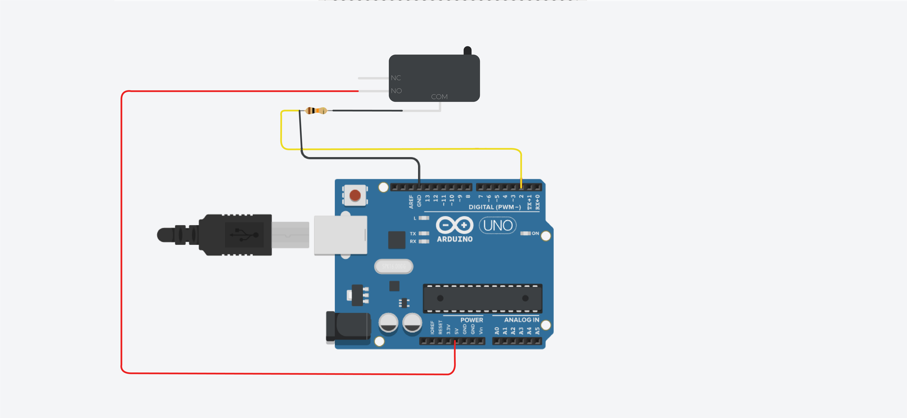

[**home**](../README.md)

# TAPE-MOUCHE

Réalisé par Marie Sandevoir étudiante de l'Ecole de design Nantes Atlantique.

## LE PRINCIPE

Le jeu de la taupe est un jeu d'arcade dont le but est de taper, à l'aide d'un maillet, les taupes sortant de la borne d'arcade. Les taupes sortent de la borne de manière totalement aléatoire. L'objectif étant d'en taper le plus possible dans un temps limité.

Ici, le tape mouche est une déclinaison du tape taupe. En effet, au lieu de taper sur des taupes, le joueur tapera sur des mouches à l'aide d'une tapette à mouche.


## REGLES DU JEU

Pour commencer une partie, appuyer sur le bouton rouge, c'est à dire le bouton reset. Les leds vont alors s'allumer une à une, formant ainsi un compte à rebours. Une fois le compte à rebours terminé, vous avez 2 min pour réaliser le meilleur score possible :
- dès qu'une led s'allume, tapez sur la mouche correspondante avec la tapette à mouche, vous gagnerez 1 point,
- si vous tapez sur une mouche dont la led correspondante n'est pas allumée, vous perdez un point.

## LES DIFFERENTS COMPOSANTS

Pour réaliser le tape-mouche, nous allons avoir besoins d'utiliser 4 leds, 4 boutons d'arcade, un afficheur à 4 digits, et un bouton "classique".

### LES LEDS

#### Branchement

Pour brancher une led correctement, il faut connecter la patte la plus longue (+) à une sortie digitale, en l'occurrence ici le pin 2, et relier la patte la plus courte à une résistance de 220 ohms, que l'on connectera à la masse (GND)


 
#### Code

```c

int ledPin1 = 2;     // indique qu'il y a quelque chose qu'on nomme "ledPin1" de branché sur le pin 2

void setup {
    pinMode(ledPin1, OUTPUT);     // indique que "LedPin1" une sortie
}


void loop {
    digitalWrite(ledPin1, HIGH);     // envoie du courant dans ledPin1,  c'est à dire dans le pin 2
}

```

### LES BOUTONS D'ARCADE ET LE BOUTON CLASSIQUE

#### Branchement

Pour brancher un bouton d'arcade, il faut connecter la broche "NO" à l'arrivée de courant, c'est à dire au 5V. Ensuite, il faut relier la broche "COM" à une résistance de 10kohms, et ensuite connecter la résistance à la masse (GND) et à une sortie digitale. Pour brancher un bouton classique, c'est relativement similaire.




#### Code

Comment lire la valeur d'un bouton ?

```c

int bouton1 = 8;     // indique qu'il a quelque chose qu'on nomme "bouton1", branché sur le pin 8

void setup {
    Serial.begin(9600);     //initialise le moniteur série
    pinMode(bouton1, INPUT);     // indique que bouton1, c'est à dire le pin 8 est utilisé comme une entrée
}


void loop {
    int value = digitalRead(bouton1);     // lire la valeur du bouton1 et la stocker dans une variable "value"
    Serial.println(value);     // imprimer le contenu de la variable "value" dans le moniteur série
}

```

### L'AFFICHEUR A 4 DIGITS

#### Branchement

Pour brancher un afficheur à 4 digits, il faut connecter la broche "GND" à la masse, la broche "VCC" au 5V, la broche "DIO" au pin 8, et la broche "CLK" au pin 9.


#### Code

Pour utiliser l'afficheur à 4 digits, il va falloir télécharger la bibliothèque TM1637 /Grove 4-digit display.

```c

#include "TM1637.h"     // inclure la bibliothèque dédiée à l'afficheur à 4 digits
#define CLK 8     // on défini la connexion de la broche CLK sur le pin 8
#define DIO 9     // on défini la connexion de la broche DIO sur le pin 9
TM1637 tm1637(CLK, DIO);     // on attache de manière effective nos pin et notre écran
int8_t NumTab[] = {0, 1, 2, 3, 4, 5, 6, 7, 8, 9};     // on défini les caractères disponibles
int number = 4375;     // on défini une variable dans laquelle on place la valeur à afficher 


void setup() {
    tm1637.init();     // on initialise l'écran
    tm1637.set(BRIGHTEST);     // on défini la luminosité de l'écran
}


void loop(int number) {
  int number = abs(number);     // transforme la variable en nombre absolu
  tm1637.display(0, (int(number/1000)%10));     // affiche le chiffre des unités
  tm1637.display(1, (int(number/100)%10));     // affiche le chiffre des dizaines
  tm1637.display(2, (int(number/10)%10));     // affiche le chiffre des centaines
  tm1637.display(3, (number%10));     // affiche le chiffre des milliers
}

```

## L'ALEATOIRE

Par définition, il est impossible de créer de l'aléatoire. Or nous avons besoin de créer 2 variables aléatoires pour créer le tape-mouche. La première servant à définir l'intervalle de temps entre 2 leds qui s'allument, et la seconde servant à choisir laquelle des 4 leds va s'allumer.

Pour créer l'aléatoire, nous allons utiliser "randomSeed". L'aléatoire n'existant pas, nous allons le simuler. Pour réaliser ce code, il est important de laisser le pin 0 libre. En effet, nous allons lire la quantité d'électricité statique qu'il y a dans l'air dans le pin 0, et c'est cette valeur qui représentera l'aléatoire.

#### Code

Commençons par créer une variable aléatoire pour le temps. Pour cela, il faut brancher une led (voir ci-dessus, cf. les différents composants : les leds)

```c

int ledPin1 = 2;     // on indique que "ledPin1" est branché sur le pin 2
int nombreAleatoireTemps;     // on crée une variable (nombre entier) dans laquelle on placera le nombre aléatoire


void setup() {
    pinMode(ledPin1, OUTPUT);     // on indique que "ledPin1" est une sortie
    randomSeed(analogRead(0));     // on initialise la séquence aléatoire
}


void loop(){
    nombreAleatoire=random(5000);     // on place un nombre aléatoire entre 0 et 5000 dans la variable "nombreAleatoire" (entre 0 et 5sec)
    digitalWrite(ledPin1,LOW);     // on éteint ledPin1
    delay(nombreAleatoire);     // on stoppe le programme pendant le temps indiqué par la variable "nombreAleatoire"
    digitalWrite(ledPin1,HIGH);     // on allume "ledPin1"
    delay(1000);     // on stoppe le programme pendant 1000ms soit 1sec
}

```

Améliorons ce programme pour qu'il choississe également quelle led allumer parmi les 4.

#### Branchement


#### Code

```c

int ledPin1 = 2;     // on indique que "ledPin1" est branché sur le pin 2
int ledPin2 = 3;     // on indique que "ledPin2" est branché sur le pin 3
int ledPin3 = 4;     // on indique que "ledPin3" est branché sur le pin 4
int ledPin4 = 5;     // on indique que "ledPin4" est branché sur le pin 5
int nombreAleatoireTemps;     // on crée une variable (nombre entier) dans laquelle on placera le nombre aléatoire pour le temps
int nombreAleatoireLed;     // on crée une variable (nombre entier) dans laquelle on placera le nombre aléatoire pour les leds


void setup() {
    pinMode(ledPin1, OUTPUT);     // on indique que "ledPin1" est une sortie
    pinMode(ledPin2, OUTPUT);     // on indique que "ledPin2" est une sortie
    pinMode(ledPin3, OUTPUT);     // on indique que "ledPin3" est une sortie
    pinMode(ledPin4, OUTPUT);     // on indique que "ledPin4" est une sortie
    randomSeed(analogRead(0));     // on initialise la séquence aléatoire
}


void loop(){
    digitalWrite(ledPin1,LOW);     // on éteint "ledPin1"
    digitalWrite(ledPin2,LOW);     // on éteint "ledPin2"
    digitalWrite(ledPin3,LOW);     // on éteint "ledPin3"
    digitalWrite(ledPin4,LOW);     // on éteint "ledPin4"
    nombreAleatoireTemps=random(5000);     // on place un nombre aléatoire entre 0 et 5000 dans la variable "nombreAleatoireTemps" (entre 0 et 5sec)
    delay(nombreAleatoireTemps);     // on stoppe le programme pendant le temps indiqué par la variable "nombreAleatoireTemps"
    nombreAleatoireLed=random(2,6);     // on place un nombre aléatoire entre 2 et 5 dans la variable "nombreAleatoireLed"
    digitalWrite(nombreAleatoirLed,HIGH);     // on allume la led correspondant au pin "nombreAleatoireLed"
    delay(1000);     //on stoppe le programme pendant 1000ms soit 1sec
}

```

## LE TAPE-MOUCHE

### LE MATERIEL

Pour réaliser le tape-mouche vous aurez besoin :
- d'un afficheur à 4 digits,
- de 4 leds,
- de 4 boutons d'arcade,
- d'1 bouton classique.
- de planches de bois,
- de clous ou de vis,
- d'un pistolet à colle / de scotch,
- de papier kraft,
- de 4 mouches en plastiques,
- et d'une tapette à mouche.

### LE MONTAGE ELECTRONIQUE


### LE PROGRAMME

#### Principe du programme


#### Code

```c

//-----AFFICHEUR A 4 DIGITS-----//


#include "TM1637.h"     // inclure la bibliothèque
#define CLK 6     // on définit la connexion de la broche CLK sur le pin 6
#define DIO 7     // on définit la connexion de la broche DIO sur le pin 7
TM1637 tm1637(CLK, DIO);     // on attache de manière effective nos pins et notre écran
int8_t NumTab[] = {0, 1, 2, 3, 4, 5, 6, 7, 8, 9};     // on définit les caractères disponibles


//----------LEDS---------//


int ledPin1 = 2;     // on indique que "ledPin1" est branché sur le pin 2
int ledPin2 = 3;     // on indique que "ledPin2" est branché sur le pin 3
int ledPin3 = 4;     // on indique que "ledPin3" est branché sur le pin 4
int ledPin4 = 5;     // on indique que "ledPin4" est branché sur le pin 5


//----------BOUTONS---------//


int bouton1 = 8;     // on indique que "bouton1" est branché sur le pin 8
int bouton2 = 9;     // on indique que "bouton2" est branché sur le pin 9
int bouton3 = 10;     // on indique que "bouton3" est branché sur le pin 10
int bouton4 = 11;     // on indique que "bouton4" est branché sur le pin 11
int boutonReset = 12;     // on indique que "boutonReset" est branché sur le pin 12
boolean etatBouton1;     // on crée une variable que l'on nomme "etatBouton1"
boolean etatBouton2;     // on crée une variable que l'on nomme "etatBouton2"
boolean etatBouton3;     // on crée une variable que l'on nomme "etatBouton3"
boolean etatBouton4;     // on crée une variable que l'on nomme "etatBouton4"
boolean hasTapped = false;     // on crée une variable de type boolean nommée "hasTapped", et on lui donne la valeur "false"


//----------VARIABLES----------//


int nombreAleatoireTemps;     // on crée une variable qui servira à stocker la valeur aléatoire de temps
int nombreAleatoireLed;     // on crée une variable qui servira à stocker la valeur aléatoire de led
int interval = 1000;     // on définit une variable "interval" dans laquelle on stocke la valeur 1000 (qui correspondra à 1sec)
int gameTime = 120000; // on définit une variable "gameTime" dans laquelle on stocke la valeur 120000 (qui correspondra à 2 min)
int score = 0;


//------------------------------------//
//           FONCTION SETUP           //
//------------------------------------//


void setup() {

    pinMode(ledPin1, OUTPUT);     // on indique que "ledPin1" est une sortie
    pinMode(ledPin2, OUTPUT);     // on indique que "ledPin2" est une sortie
    pinMode(ledPin3, OUTPUT);     // on indique que "ledPin3" est une sortie
    pinMode(ledPin4, OUTPUT);     // on indique que "ledPin4" est une sortie

    pinMode(bouton1, INPUT);     // on indique que "bouton1" est une entrée
    pinMode(bouton2, INPUT);     // on indique que "bouton2" est une entrée
    pinMode(bouton3, INPUT);     // on indique que "bouton3" est une entrée
    pinMode(bouton4, INPUT);     // on indique que "bouton4" est une entrée

    digitalWrite(ledPin1, LOW);     // on éteint "ledPin1"
    digitalWrite(ledPin2, LOW);     // on éteint "ledPin2"
    digitalWrite(ledPin3, LOW);     // on éteint "ledPin3"
    digitalWrite(ledPin4, LOW);     // on éteint "ledPin4"

    randomSeed(analogRead(0));     // on initialise la séquence aléatoire
    Serial.begin(9600);     // on initialise le moniteur série
    tm1637.init();     // on initialise l'écran de l'afficheur à 4 digits
    tm1637.set(BRIGHTEST);     // on définit la luminosité de l'afficheur à 4 digits

}


//------------------------------------//
//          FONCTION TESTLED          //
//------------------------------------//


// au début de chaque partie, les leds vont s'allumer une à une. Cela permettra de vérifier que chaque led fonctionne correctement, mais également de faire un compte à rebours avant le départ.

void testLed() {

    digitalWrite(ledPin1, HIGH);     // on allume "ledPin1"
    delay(1000);     // on arrête le programme pendant 1 sec
    digitalWrite(ledPin2, HIGH);     // on allume "ledPin2"
    delay(1000);     // on arrête le programme pendant 1 sec
    digitalWrite(ledPin3, HIGH);     // on allume "ledPin3"
    delay(1000);     // on arrête le programme pendant 1 sec
    digitalWrite(ledPin4, HIGH);     // on allume "ledPin4"
    delay(1000);     // on arrête le programme pendant 1 sec

    digitalWrite(ledPin1, LOW);     // on éteint "ledPin1"
    digitalWrite(ledPin2, LOW);     // on éteint "ledPin2"
    digitalWrite(ledPin3, LOW);     // on éteint "ledPin3"
    digitalWrite(ledPin4, LOW);     // on éteint "ledPin4"

}


//------------------------------------//
//      FONCTION GIMMEMYSCORE         //
//------------------------------------//


// la fonction "gimmemyscore" permet de vérifier lorsqu'une led est allumée, si on appuie bien sur le bouton correspondant. Dans ce cas, la fonction retourne la valeur 1, et dans le cas contraire, si on clique sur un bouton dont la led correspondante n'est pas allumée, la fonction retourne -1. Pour rappel, dans mon montage, j'ai décidé d'associer "ledPin1" (pin 2) et "bouton1" (pin 8), "ledPin2" (pin 3) et "bouton2" (pin 9), "ledPin3" (pin 4) et" bouton3" (pin 10), "ledPin4" (pin 5) et "bouton4" (pin 11).

int gimmemyscore(int led) {     // pour la fonction "gimmemyscore" on utilise une variable (un entier) "led"
    
    if (led == 2) {     // si la variable "led" est égale à 2
        if (digitalRead(bouton1) == 1) {     // si la valeur de "bouton1" est égal à 1
            return 1;     // alors la fonction "gimmemyscore" retourne 1
        } else if (digitalRead(bouton2) == 1 || digitalRead(bouton3) == 1 || digitalRead(bouton4) == 1) {     // sinon, si "bouton2" ou "bouton3" ou "bouton4" est égale à 1
            return -1;     // alors la fonction "gimmemyscore" retourne -1
        }
    }

    if (led == 3) {     // si la variable "led" est égale à 3
        if (digitalRead(bouton2) == 1) {     // si la valeur de "bouton2" est égale à 1
            return 1;     // alors la fonction "gimmemyscore" retourne 1
        } else if (digitalRead(bouton1) == 1 || digitalRead(bouton3) == 1 || digitalRead(bouton4) == 1) {     // sinon, si "bouton1" ou "bouton3" ou "bouton4" est égale à 1
            return -1;     // alors la fonction "gimmemyscore" retourne -1
        }
    }

    if (led == 4) {     // si la variable "led" est égale à 4
        if (digitalRead(bouton3) == 1) {     // si la valeur de "bouton3" est égale à 1
            return 1;     // alors la fonction "gimmemyscore" retourne 1
        } else if (digitalRead(bouton1) == 1 || digitalRead(bouton2) == 1 || digitalRead(bouton4) == 1) {     // sinon, si "bouton1" ou "bouton2" ou "bouton4" est égale à 1
            return -1;     // alors la fonction "gimmemyscore" retourne -1
        }
    }

    if (led == 5) {     // si la variable "led" est égale à 5
        if (digitalRead(bouton4) == 1) {     // si la valeur de "bouton4" est égale à 1
            return 1;     // alors la fonction "gimmemyscore" retourne 1
        } else if (digitalRead(bouton1) == 1 || digitalRead(bouton2) == 1 || digitalRead(bouton3) == 1) {     // sinon, si "bouton1" ou "bouton2" ou "bouton3" est égale à 1
            return -1;     // alors la fonction "gimmemyscore" retourne -1
        }
    }

    return 0;     // si on appuie sur aucun bouton alors qu'une led est allumée, la fonction "gimmemyscore" retourne 0
    
}


//------------------------------------//
//          FONCTION DISPLAY          //
//------------------------------------//


// cette fonction permet d'afficher le score du joueur sur l'afficheur à 4 digits

void display(int number) {     // pour la fonction "display", on utilise une variable "number"

  int num = abs(number);     // on stocke dans la variable "num" la valeur absolue de la variable "number"
  tm1637.display(0, (int(num/1000)%10));     // affiche le chiffre des unités de la variable "number"
  tm1637.display(1, (int(num/100)%10));     // affiche le chiffre des dizaines de la variable "number"
  tm1637.display(2, (int(num/10)%10));     // affiche le chiffre des centaines de la variable "number"
  tm1637.display(3, (num%10));     // affiche le chiffre des milliers de la variable "number"

}


//------------------------------------//
//           FONCTION LOOP            //
//------------------------------------//


void loop() {

    score = 0;     // on remet la valeur de la variable "score" à 0
    display(0);     // on effectue la fonction "display" avec la variable "number" égale à 0, c'est à dire qu'on va afficher 0 sur l'afficheur à 4 digits

    while (digitalRead(boutonReset) == 0 ) { }     // tant que l'on appuie pas sur le "boutonReset", le programme attend avant de poursuivre

    unsigned long gameStart = millis();     // on place dans la variable "gameStart" la valeur correspondante au temps depuis lequel la carte arduino a été allumée
    testLed();     // on effectue la fonction "testLed", c'est à dire le compte à rebours avant le départ

    while( gameStart + gameTime > millis() ) {     // tant que la valeur de la variable "gameStart" plus celle de la variable "gameTime" (2min) est supérieure au temps depuis lequel la carte arduino a été allumée, on continue d'effectuer la boucle "while", c'est à dire que pendant 2min, on effectue "while" en boucle

        nombreAleatoireTemps = random(5000);     // on place un nombre aléatoire entre 0 et 5000 dans la variable "nombreAleatoire" (entre 0 et 5sec)
        nombreAleatoireLed = random(2, 6);     // on place un nombre aléatoire entre 2 et 5 dans la variable "nombreAleatoireLed"
    
        unsigned long start = millis();     // on place dans la variable "start" la valeur correspondante au temps depuis lequel la carte arduino a été allumée
    
        while ( start + nombreAleatoireTemps > millis() ) {     // tant que la valeur de la variable "start" plus celle de la variable "nombreAleatoireTemps" est supérieure au temps depuis lequel la carte arduino a été allumée, on continue d'effectuer la boucle "while"
    
            boolean tappedThisFrame = digitalRead(bouton1) == 1 || digitalRead(bouton2) == 1 || digitalRead(bouton3) == 1 || digitalRead(bouton4) == 1;     // on vérifie si le joueur a appuyé sur un des 4 boutons
    
            if (tappedThisFrame && !hasTapped) {     // si le joueur a tapé un bouton à ce passage de boucle mais pas à celui d'avant
                score += -1;     // alors on ajoute -1 à la variable "score"
                if (score < 0) {     // si le score est inférieur à 0
                    score = 0;     // alors le score est égal à zéro, de ce fait, on empêche le joueur d'avoir un score négatif
                }
                display(score);     // on effectue la fonction "display" avec la variable "score", c'est à dire que l'on va afficher le score du joueur sur l'afficheur à 4 digits
                hasTapped = true;     // on change la valeur de la variable "hasTapped" par true
            }
    
            if (!tappedThisFrame) {     // si on n'a pas appuyé sur un bouton lors de ce passage de la boucle
                hasTapped = false;     // alors on change la valeur de la variable "hasTapped" par "false"
            }
        }
    
        start = millis();     // on place dans la variable "start" la valeur correspondante au temps depuis lequel la carte arduino a été allumée
        boolean hasPointGagner = false;     // on impose la valeur "false" à la variable "hasPointGangner"
        boolean hasPointPerdu = false;     // on impose la valeur "false" à la variable "hasPointGangner"
    
        digitalWrite(nombreAleatoireLed, HIGH);     // on allume la led correspondante au pin "nombreAleatoireLed"
    
        while (start + interval > millis() && !hasPointGagner) {     // tant que la valeur de la variable "start" plus celle de la variable "interval" (1sec) est supérieure au temps depuis lequel la carte arduino a été allumée et que la valeur de la variable "hasPointGagner" est égale à "false"
    
            int point = gimmemyscore(nombreAleatoireLed);     // on effectue la fonction "gimmemyscore" avec la valeur de la variable "nombreAleatoireLed"
                
            if (point != 0 && !hasTapped) {     // si la valeur de la variable "point" est différente de 0, et que on a appuyé sur un bouton
                score += point;     // alors on ajoute la valeur de la variable "point" à la valeur de la variable "score"
                if (score < 0) {     // si la valeur de la variable "score" est inférieure à zéro
                    score = 0;     // alors la valeur de la variable "score" est égale à zéro, de ce fait, on empêche le joueur d'avoir un score négatif
                }
                hasTapped = true;     // alors on change la valeur de la variable "hasTapped" par "true"
                display(score);     // on effectue la fonction "display" avec la variable "score", c'est à dire que l'on va afficher le score du joueur sur l'afficheur à 4 digits
            }
    
            if (point == 0) {     // si la valeur de la variable "point" est égale à zéro
                hasTapped = false;     // alors on change la valeur de la variable "hasTapped" par "false"
            }
    
            if (point == 1) {     // si la valeur de la variable "point" est égale à 1
                hasPointGagner = true;     // alors on change la valeur de la variable "hasPointGagner" par "true"
            }
    
            if (point == -1) {     // si la valeur de la variable "point" est égale à -1
                hasPointPerdu = true;     // alors on change la valeur de la variable "hasPointPerdu" par "true"
            }
        }
    
        digitalWrite(nombreAleatoireLed, LOW);     // on éteint la led correspondante au pin "nombreAleatoireLed"
    
        if (!hasPointGagner && !hasPointPerdu && score < 0) {     // si la valeur de la variable "hasPointGagner" est égale à false et que la valeur de la variable "hasPointPerdu" est égale à false et que la valeur de la variable "score" est inférieure à zéro
            score -= 1;     // alors on enlève 1 à la valeur de la variable "score"
        }
    
        display(score);     // on effectue la fonction "display" avec la valeur de la variable "score"

    }

}


```

### LE TAPE-MOUCHE

#### Montage du socle

Pour réaliser le support du jeu, vous aurez besoin de planches et de clous ou de vis, au choix.

Pour commencer vous aurez besoin d'une planche A, une planche B, une planche C, et deux planches D, en suivant les mesures ci-dessous.


Vous pouvez également prévoir un petit trou sur la planche B pour faire passer le cable nécessaire au branchement de la carte arduino.


#### Assemblage final


[**home**](../README.md)
