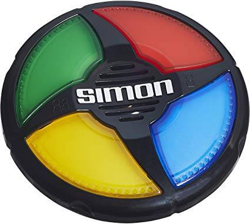
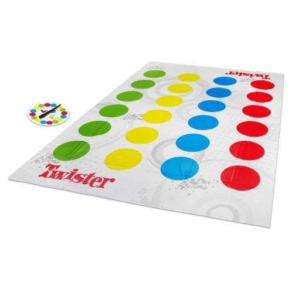
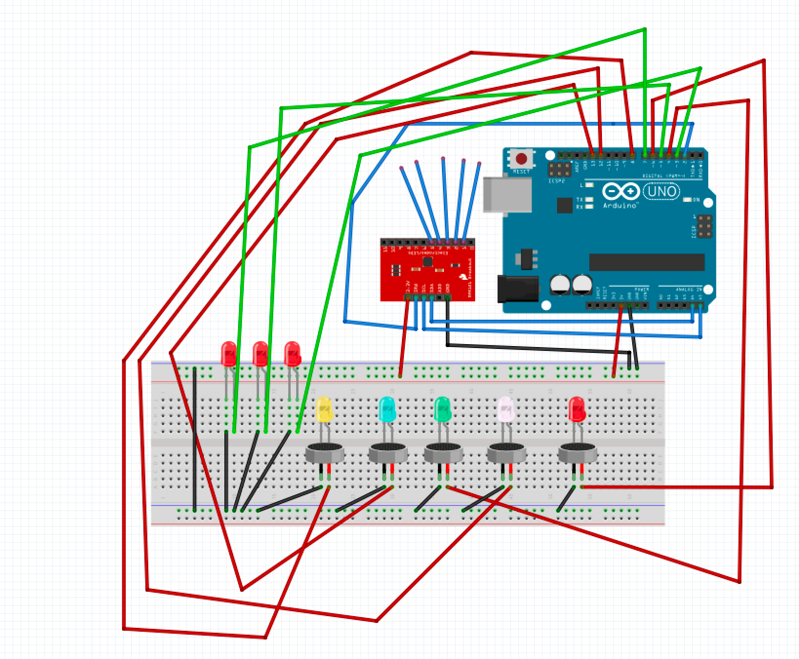
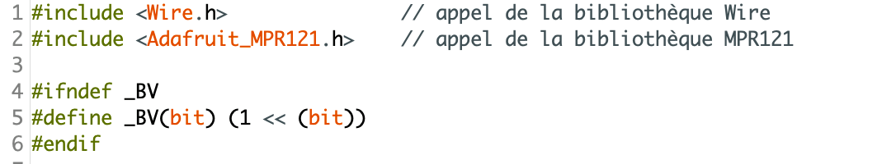
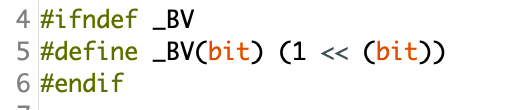
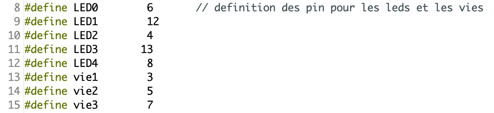
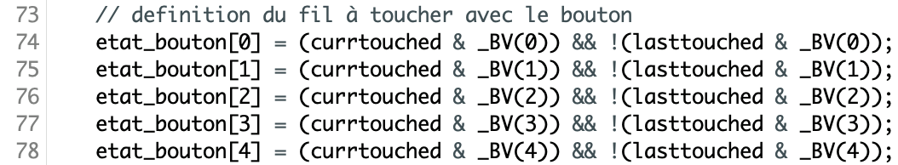

[**home**](../README.md)

# **TouchMe**

Jeu électronique basé sur Arduino

Réalisé par Hugo Prevost et Aurore Tanguy à l’Atelier Numérique de L’Ecole de Design Nantes Atlantique

## Nos inspirations

Pour créer TouchMe, nous nous sommes inspirés de plusieurs jeux. En premier, du jeu Simon où il faut retenir une série de couleurs et la reproduire en touchant les couleurs indiquées sur le plateau. Mais aussi du jeu twister où il faut mettre ses mains ou ses pieds sur des couleurs précises. Delà, Nous avons voulu créer un nouveau mode de jeu, pour s’immerger plus profondément dans le gameplay. Pour cela, nous avons choisi de faire un jeu qui se porte sur soi et qui est déplaçable. C’est pour cela que nous avons conçu un gilet interactif et immersif : TouchMe.

## Matériaux

Pour réaliser notre jeu, nous avons utilisé plusieurs matériaux, comme une carte arduino uno, des leds pour voir les zones actives, des vibreurs qui vont apporter plus de sensation et de surprise à l’utilisateur lorsque les zones s’activent. D’un point de vu pratique, nous avons utilisé un MPR121 dans le but de rendre les zones touchables, tactiles en contact direct avec le corps. Plutôt que d’utiliser des boutons, nous avons positionné du scotch conducteur pour détecter si l’on touche ou non les zones. Pour immerger l’usager, nous avons choisi de le réaliser notre jeu sur un gilet, que l’utilisateur devra porter pour jouer. Pour que le MPR121 fonctionne, relier la sortie des pin 0, 1, 2, 3 et 4 aux zones tactiles en les accrochant avec du scotch conducteur.

## Règle du jeu

- **1** Le jeu consiste, en premier, à enfiler le gilet.
- **2** Une zone va s’activer à l’aide d’un vibreur et d’une led, qui s’enclenchent en même temps. L’objectif est de stimuler le sens du toucher et de la vue.
- **3** Le but : toucher la zone le plus rapidement possible avant qu’elle ne s’arrête de vibrer.
- **4** Une fois touchée, la zone va changer de place et ainsi de suite.

Pour ajouter du gameplay à notre jeu, nous avons choisi de donner trois vies à l’utilisateur. Si l’utilisateur se trompe de zone, il perd une vie. Et s’il prend trop de temps pour toucher la zone, il perd une vie. Plus l’utilisateur va avancer dans les niveaux, plus le temps d’activation de la zone sera courte. Quand l’utilisateur perds toutes ses vies, la partie est finie. Alors bon courage pour déjouer la stratégie de TouchMe. À vous de jouer.

## Fonctionnement

Au début de la partie, il y a une animation avec les vies afin que l’utilisateur se prépare avant de jouer. Une fois l’animation terminée, une zone va se mettre à vibrer et la led de la zone va s’allumer. L’utilisateur doit toucher cette zone avec son doigt. La led va permettre, aussi, d’être un indicateur de temps : plus la led va mettre de temps à clignoter, moins de temps il restera pour toucher la zone. Un système de niveau peut-être mis en place en augmentant la rapidité du touché, ainsi qu’un système de point pour avoir un côté compétitif dans notre jeu.

Cependant, s’il se trompe de zone ou si il met trop de temps pour toucher la zone active, il perd une vie. L’utilisateur à trois vies au début de la partie, s’il les perd alors la partie est finie. Le gilet disposera de 4 ou 5 zones constituées de fils conducteurs afin d’alléger le coût des différents capteurs. Pour recommencer une partie, il suffit d’appuyer sur le gros bouton reset, situé dans la poche du gilet.

## Code

Pour commencer le code, nous nous sommes basés sur les bibliothèques Adafruit_MPR121 et Wire.

Par la suite, nous allons définir les zones tactiles du MPR121.

Ensuite, nous allons définir les pin pour allumer les leds.

Pour savoir si la zone touchée correspond à la bonne branche du MPR121 nous allons utiliser :

Pour avoir tout le code détaillé, il faut lancer le programme et lire à côté de chaque ligne ce qu’il y a après les deux slash.

[test-code-propre-pcode.ino](documentation/test-code-propre-pcode.ino)

### À bientôt !

### Pour nous contacter allez sur :

Hugo : http://neocolossus.lecolededesign.com/hprevost/Portfolio/

Aurore : auroretanguy.com

[**home**](../README.md)