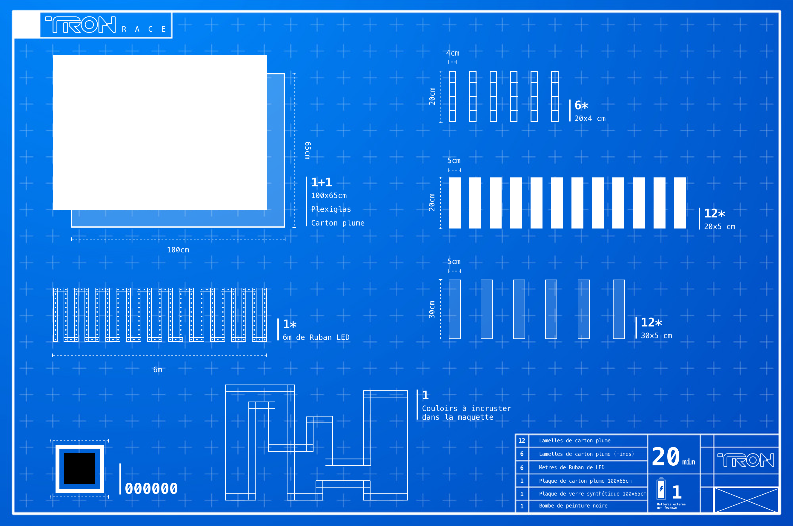

[**home**](../README.md)

# Tron Race

Tron race est un jeu de type arcade fonction sous arduino, monté initialement sur une carte arduino UNO.

Le jeu reprend l'idée et l'univers des courses de motos de la célèbre saga ***Tron***.

Le gameplay est simple et intuitif : à chaque pression sur le bouton correspondant à votre couleur de joueur, votre LED avance d'une unité. Ainsi, pour gagner la course et faire s'illuminer le circuit de votre couleur il faudra être plus rapide que votre adversaire.

À vous de jouer, bonne chance !




```c
#include <FastLED.h>
#include <EasyButton.h>

boolean etatBouton1;
boolean etatBouton2;
#define BUTTON_ONE_PIN 8    //Emplacement Bouton joueur 1
#define BUTTON_TWO_PIN 7    //Emplacement Bouton joueur 2

#define LED_PIN 6           //Emplacement ruban de LED
#define COLOR_ORDER RGB     //Ordre du code couleur
#define LED_TYPE WS2812     //Type de bande LED
#define NUM_LEDS 7          //Nombre de LEDS

uint8_t max_bright = 100;   //Luminosité max

struct CRGB leds[NUM_LEDS];

EasyButton button1(pinBouton1);
EasyButton button2(pinBouton2);

int index1 = 0;
int index2 = 0;

struct Player {
  int buttonPin;
  int prevPosition;
  int position;
  bool isWinner;
  bool blinking;
  CRGB::HTMLColorCode color;
};

struct Player player1;
struct Player player2;

int raceCountdown = 3;
bool raceFinished = false;


void onButton1Pressed() {

  //AVANCEMENT DES LEDS À CHAQUE PRESSION
  for (int i = 0 ; i < NUM_LEDS; i++) {
    if (i == index1) {
      leds[i] = CRGB::Blue;
    }
    else {
      leds[i] = CRGB(0, 0, 0);
    }
  }
  FastLED.show();
  index1 ++;

}


void onButton2Pressed() {

  //AVANCEMENT DES LEDS À CHAQUE PRESSION
  for (int i = 0 ; i < NUM_LEDS; i++) {
    if (i == index2) {
      leds[i] = CRGB::Yellow;
    }
    else {
      leds[i] = CRGB(0, 0, 0);
    }
  }
  FastLED.show();
  index2 ++;

}


void setup() {
  
  delay(1000);
  for (int i = 0 ; i < NUM_LEDS; i++) {
    leds[i] = CRGB(0, 0, 0);
  }

  LEDS.addLeds<LED_TYPE, LED_PIN, COLOR_ORDER>(leds, NUM_LEDS);
  FastLED.setBrightness(max_bright);
  Serial.begin(9600);
  pinMode(pinBouton1, INPUT);
  pinMode(pinBouton2, INPUT);


  button1.begin();
  // PRESSION DU BOUTON
  button1.onPressed(onPressed);

  button2.begin();
  // PRESSION DU BOUTON
  button2.onPressed(onPressed);

  FastLED.addLeds<WS2812, LED_PIN, RGB>(leds, NUM_LEDS);


  initPlayer(&player1, pinBouton1, CRGB::Blue);
  initPlayer(&player2, pinBouton2, CRGB::Orange);

  FastLED.addLeds < WS2812, LED_PIN, RGB > (leds, NUM_LEDS);
  
}


void onPressed() {
  //AVANCEMENT DES LEDS À CHAQUE PRESSION
  for (int i = 0 ; i < NUM_LEDS; i++) {
    if (i == index) {
      leds[i] = CRGB::Blue;
    }
    else {
      leds[i] = CRGB(0, 0, 0);
    }
  }
  FastLED.show();
  index ++;
}


void loop() {

  button1.read();
  button2.read();

  if (raceFinished) {
    raceFinished = true;
  }

  delay(15);
}


void initPlayer(struct Player *player, int pin, CRGB::HTMLColorCode color)  {
  player->buttonPin = pin;
  player->prevPosition = 0;
  player->position = 0;
  player->isWinner = false;
  player->blinking = false;
  player->color = color;
}


void movePlayer(struct Player *player) {

  player->prevPosition = player->position;
  player->position = (player->position + 1);

  if (player->position == NUM_LEDS) {
    player->isWinner = true;
  }


bool RaceFinished() {
  
  return player1.isWinner || player2.isWinner;

  if (player1.isWinner) {
    leds = CRGB::Blue;
  } else if (player2.isWinner) {
    leds = CRGB::Orange;
  }
  FastLED.show();
  
}
```


[**home**](../README.md)