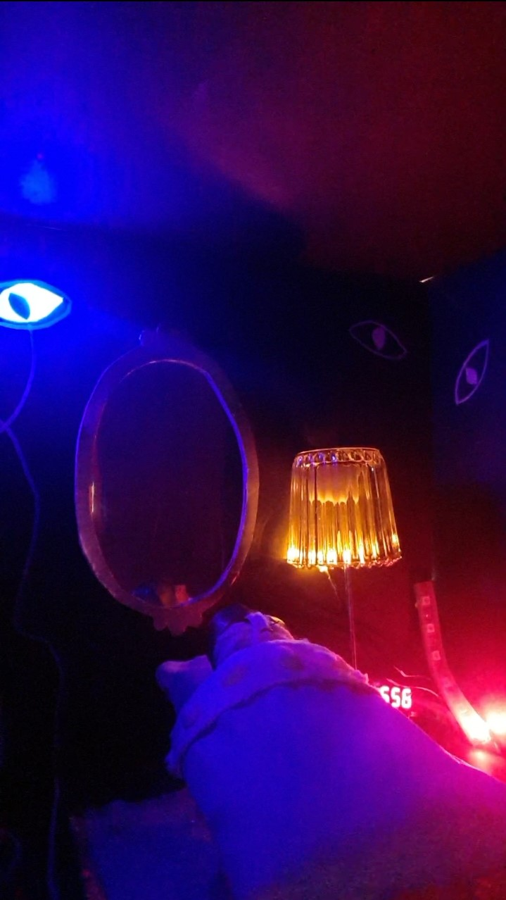
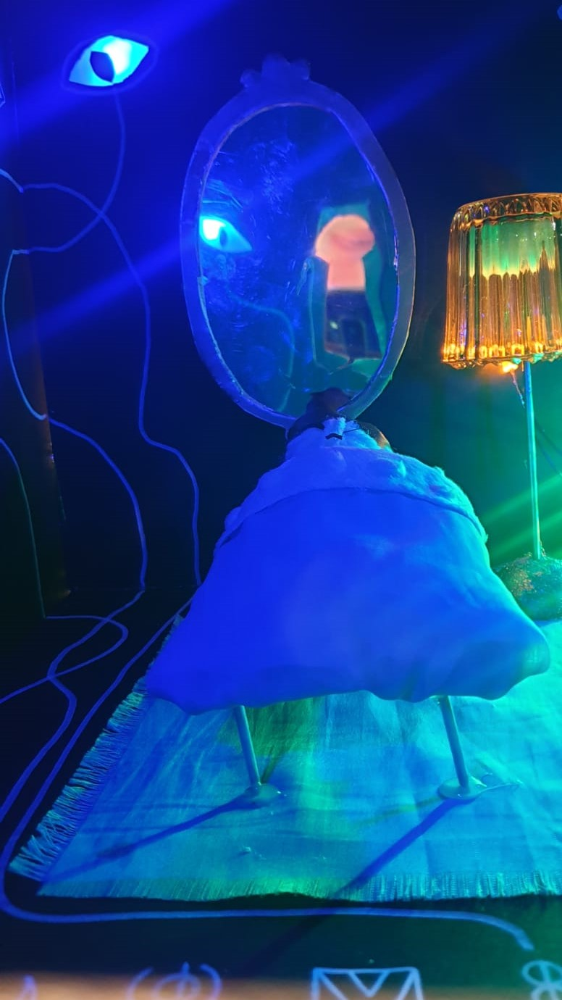
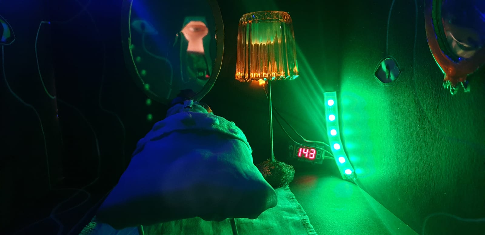
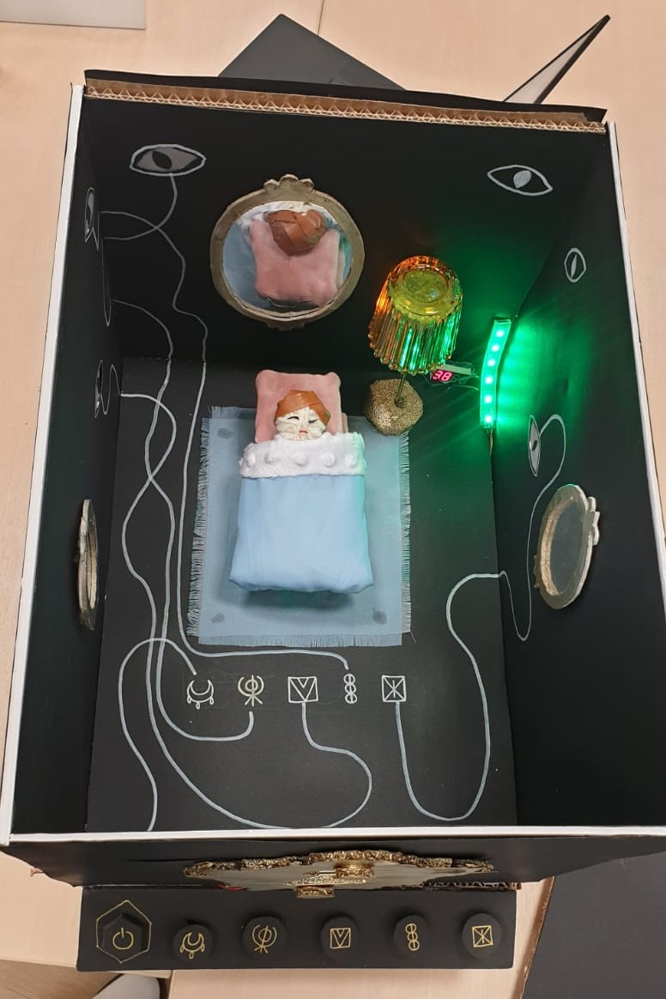
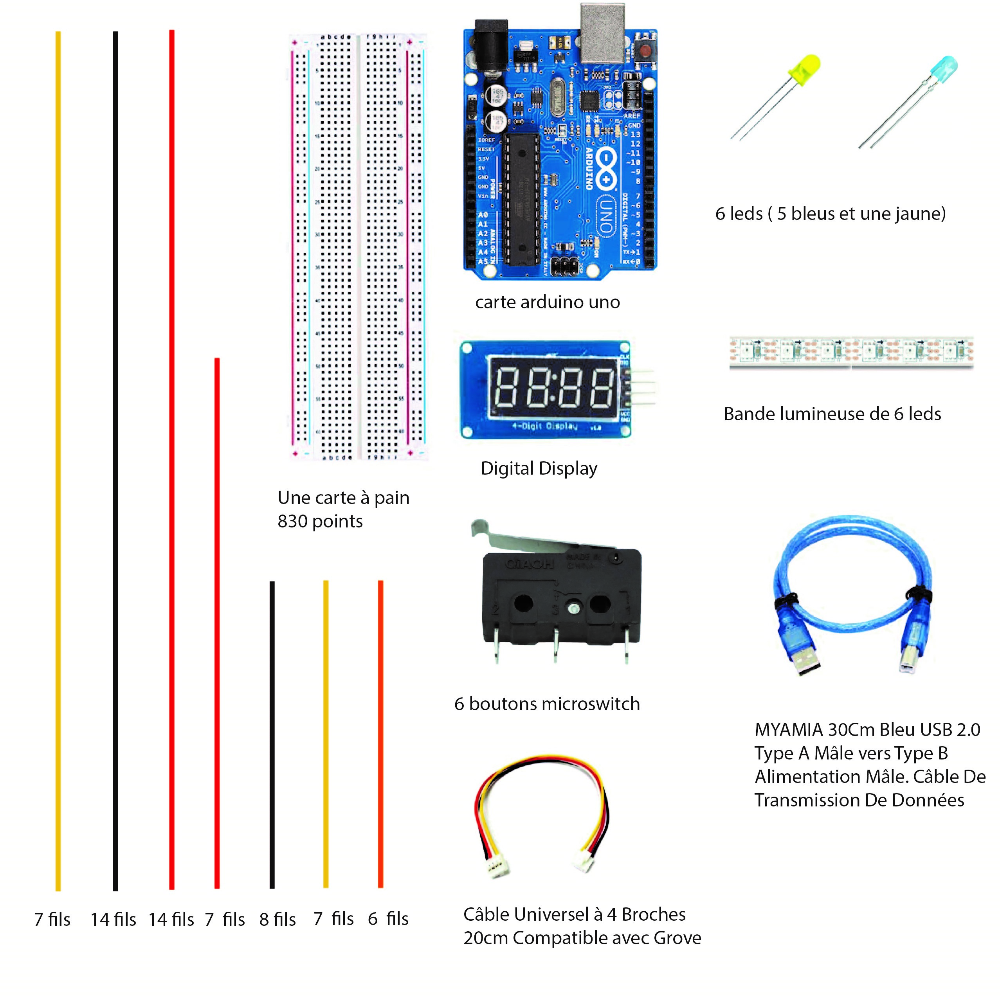
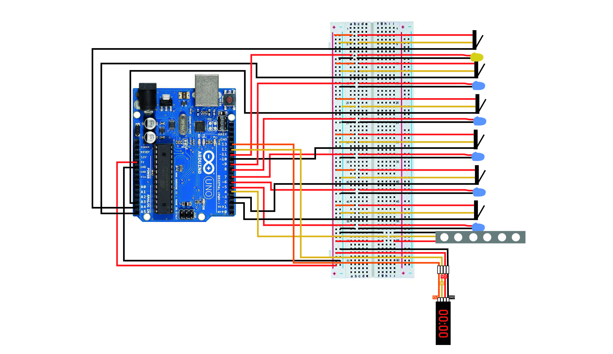
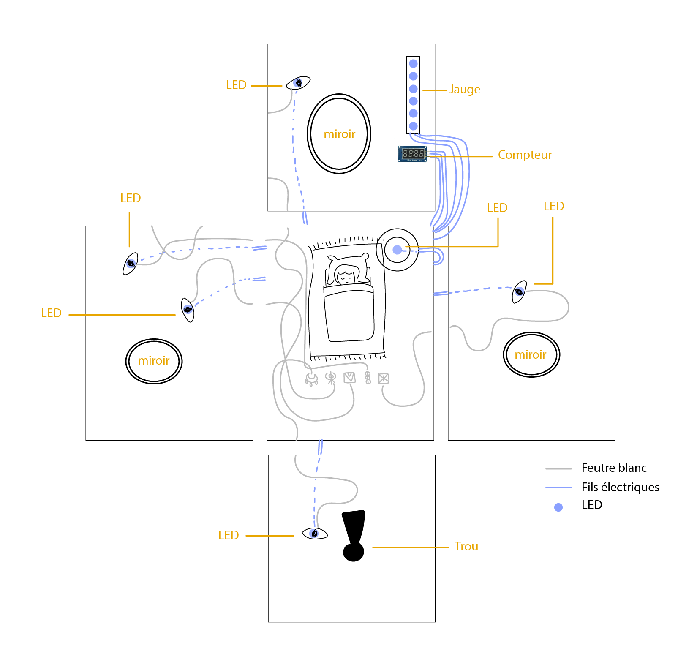
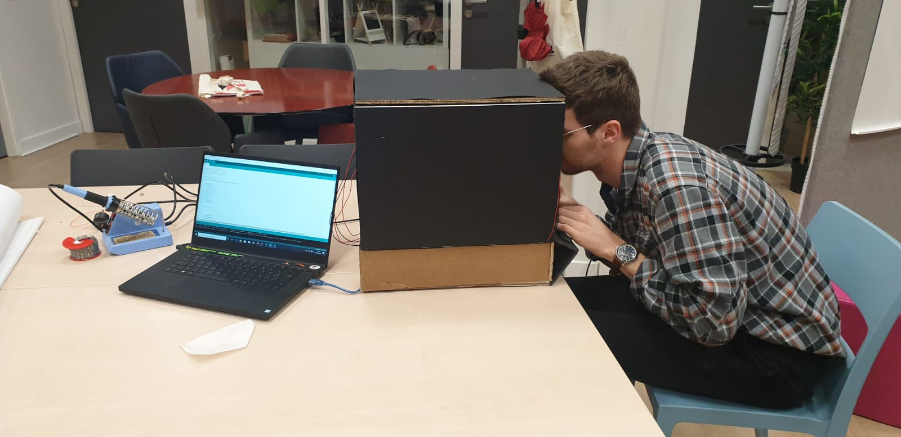

[**home**](../README.md)

# Witching Hour

## Histoire du jeu

A travers le trou de la serrure d'une chambre d'enfant, on peut observer un petit garçon dormir dans son lit, sa chambre étant éclairée par le faible halo de lumière diffusé par une étrange lampe. Pendant la nuit, des monstres s'invitent dans la chambre et viennent infiltrer de terribles cauchemars dans les rêves du petit garçon. Le rôle du joueur est de chasser ces monstres le plus longtemps possible de la chambre de l'enfant, afin de protéger son sommeil. 

Le décor du jeu est plongé dans des lumières artificielles et saturées qui lui donnent une ambiance magique entre l'enfantin et le glauque. Nous avons voulu créer un univers de magie contemporaine, où la sorcellerie s'invite dans le numérique. C'est pourquoi nous avons appelé le jeu Witching Hour, soit le moment de la nuit où la magie noire est la plus puissante, et où les sorcières, démons, et fantômes sortent dans la culture celtique.





## Règles du jeu

Le joueur se trouve face à une boîte et regarde à l’intérieur par le trou à l'avant. Les monstres sont représentés par des yeux illuminés par une lumière bleue. Ces 5 yeux sont répartis sur les murs de la chambre et s'allument simultanément de manière aléatoire, pendant 3 secondes. Si on n'éteint pas la lumière de l’œil avant qu'elle s'éteigne toute seule, on perd des points. Pour l'éteindre, on doit localiser l’œil allumé, suivre le trait sinueux qui le relie au centre de la chambre, sans tomber dans les pièges de croisements entre traits, et ainsi déterminer à quel symbole dessiné au sol cet œil est relié. Ces 5 symboles sont également représentés sur 5 boutons à l'extérieur de la boîte. C'est sur le bouton avec le symbole identique à celui relié à l’œil du monstre allumé que le joueur doit appuyer pour chasser ce monstre. 

Pour commencer une partie, le joueur appuie sur le bouton Start à l'extérieur de la boîte. A l’intérieur, on peut alors voir le compteur de temps qui se lance, et à côté, la jauge qui affiche le nombre de points, comme une jauge de vie. Elle est verte et totalement allumée au début, puis si on perd des points, le nombre de LEDs allumées diminue et celles-ci deviennent rouges quand le nombre de points commence à devenir très bas. Quand le joueur a perdu tous les points, le chrono s'arrête et marque le score du joueur.

Les symboles utilisés dans le jeu sont tirés des symboles mystiques médiévaux : symbole de la sorcière, de la guérison, de la bénédiction, de la protection de l'enfant...



## Matériel pour la boîte

- Boîte : Carton plume noir pour une boîte de 30cm x 30cm x 40cm
- Compartiment inférieur : carton plume noir
- Boutons : 5 cercles et 1 polygone de carton plume noir, et 2 rectangles de carton plume noir pour le support
- Trou de serrure : carton plume bombé en doré
- Eléments de décoration : miroirs avec cadres en carton plume bombé en doré, tissus pour le tapis
- Lampe : un verre coloré, tige métallique, mousse
- Lit, oreiller et tête de l'enfant : tissus de différentes couleurs et matières, coton en boule, tiges métalliques, pelote de laine, fil de cuir)



## Matériel pour le montage





## Les bibliothèques utilisées

Nous avons utilisé la bibliothèque Seven SegmentTM1637.h pour le chrono et la bibliothèque
 Adafruit_NeoPixel.h pour la jauge.


**Seven SegmentTM1637.h:**
```c
#define BROCHE_CLK 13      *//On associe les broches de l'afficheur aux broches de la carte*
#define BROCHE_DIO 12        

SevenSegmentTM1637 afficheur(BROCHE_CLK, BROCHE_DIO);    // 
```
*puis on les associe à la librairie* **Adafruit_NeoPixel.h:**
```c
#define PIN 4                                *// quel pin de la carte est connectée à Neopixel*
#define NUMPIXELS 6            *// Combien de pixels sont attachés à la carte*

Adafruit_NeoPixel pixels(NUMPIXELS, PIN, NEO_GRB + NEO_KHZ800);   
// Quand on appel la librairie, on lui dit combien de pixel et quel pin sont utilisées pour envoyer les signals.*

pixels.clear();    //*en état off*
int nPixel = map(score, 0, 1200, 0, NUMPIXELS + 1);  
// On déclare une variable qui transforme le score de 0 à 1200 en 0 pixel à 6 pixels grâce à map*
pixels.setPixelColor(i, pixels.Color(150, 0, 0));   
// On peut aussi changer la couleur des pixels*
pixels.show();    //* les pixels sont envoyés sur la bande lumineuse ( la jauge)*
```

## Notice de montage

1. Souder les LEDs et tous les boutons à des fils d'une 30aine à une 40aine de cm
2. Souder le ruban de LED et l'afficheur à 4 chiffres à des fils d'une 40aine de cm
3. Découper les 6 faces de la boîte dans le carton plume : 4 parois, un plafond et un sol.
4. Coller par les 4 coins une feuille noire de la même dimension que les 4 parois sur les deux faces de celles-ci. Découper 5 trous en forme d'yeux, de manière homogène sur les 4 parois de la boîte, en faisant attention à ne couper que dans la feuille intérieure à la boîte et dans le carton plume. La feuille extérieure doit rester intacte pour assurer l'aspect esthétique depuis l’extérieur de la boîte.
5. Coller un bout de papier calque entre la feuille intérieure et le carton plume, pour recouvrir les trous des yeux. Coller un petit papier noir découpé en forme de pupille au milieu de chaque oeil sur le papier calque.
6. Insérer les LEDs dans les trous des yeux en passant les fils entre la feuille intérieure et le carton plume de chaque paroi et les laissant sortir par le bas.
7.  Dans la face avant, découper un trou en forme de trou de serrure. Découper dans un carton plume une forme de serrure et deux cercles pour faire les vis et coller celles-ci sur la serrure. Bomber le tout en doré. Laisser sécher puis coller la serrure sur l'extérieur de la paroi avant de la boîte, au niveau du trou de serrure.
8. Découper les 4 parois et la base du compartiment inférieur de la boîte et l'assembler à la colle chaude en prenant soin de découper une ouverture à l'arrière pour faire sortir le câble de la carte Arduino et à l'avant pour pouvoir placer les 5 boutons de commande devant la boîte.
9. Réaliser l'assemblage du circuit électrique en connectant les LEDs et les boutons sur la breadboard, branchée à la carte Arduino. Brancher également le ruban de LED et le compteur à 4 chiffres. Placer l'ensemble dans le compartiment réalisé juste avant.
10. Coller à la colle chaude la paroi de gauche, celle du fond et celle de l'avant au sol de la boîte en laissant bien passer les fils des LEDs vers le bas pour les cacher dans le compartiment inférieur.
11. Découper 2 miroirs ovales de petite tailles et 1 plus grand. Découper et bomber en doré un cadre de carton plume pour chaque miroir. Coller à la colle chaude les cadres sur les miroirs. Coller à la colle chaude les 2 petits miroirs sur les parois de gauche et droite et le grand sur la paroi du fond, un peu à gauche, pour qu'on puisse y voir le reflet de son propre œil dans le trou de serrure et l’œil du monstre sur la paroi avant.
12. Faire le lit en collant sur un rectangle de carton plume 4 pieds de lit en tige métallique et une couverture de gros coton recouvert de tissus. Coller la tête du garçon (de boule de laine, recouverte de fil de cuir pour les cheveux) entre la couverture et le coussin (coton emballé de velours). Coller au sol de la boîte, vers le fond-centre, un rectangle de tissus effiloché sur les bords pour faire le tapis. Coller dessus les 4 pieds du lit.
13. Faire la lampe : découper dans une mousse le pied et une forme qu'on mettra dans l'abat jour pour le stabiliser. Enfoncer dans le pied une tige métallique et bomber le tout. Dans le verre en verre coloré qui fait office d'abat jour, coller la mousse et enfoncer en collant la tige métallique dedans. Coller la lampe au sol au fond à droite du lit dans la boîte.
14. Dessiner au milieu du sol les 4 symboles à la lignée, au feutre blanc. Prendre soin qu'on les voit bien en regardant dans le trou de serrure. Tracer au feutre blanc des lignes sinueuses et entremêlées entre chaque œil et un des symboles au sol. 
15. L'intérieur de la boîte étant fini, on peut maintenant la fermer, en collant la paroi de droite à la colle chaude au reste de la boîte, en prenant soin de laisser passer le compteur et le ruban de LED à l'intérieur de la boîte, ainsi que la LED que l'on place dans l'abat jour de la lampe. Coller la jauge et le compteur en haut à droite de la paroi du fond.
16. On réalise alors le tableau de commande à l'avant de la boîte: découper 5 cercles dans du carton plume noir. Dessiner au feutre doré un symbole sur chaque cercle. Découper un polygone également et y dessiner un symbole Power. 
17. Découper 2 rectangles de la largeur de la boîte dans le carton plume noir, l'un plus étroit que l'autre. Dans ce dernier, découper 6 petits rectangles à espace régulier, de la taille des boutons. Insérer et coller le bouton qui lance la partie dans le trou tout à gauche. Faire passer et coller les 5 boutons attitrés aux LEDs (elles, attitrées aux symboles) dans les trous, en faisant attention de recopier l'ordre des symboles dessinés dans la boîte. Coller les cercles et le polygone sur les boutons attitrés selon le symbole. 
18. Coller le support des bouton à l'autre rectangle de carton plume et coller le tout à l'avant de la boîte.
19. Bien positionner la boîte sur le compartiment inférieur et connecter la carte Arduino à l'alimentation ou l'ordinateur.
20. Jouer!



# A vous de jouer!



Projet de Jeanne Verstraete et Emilie Schaefer, à l'Ecole de design Nantes Atlantique, février 2020

[**home**](../README.md)