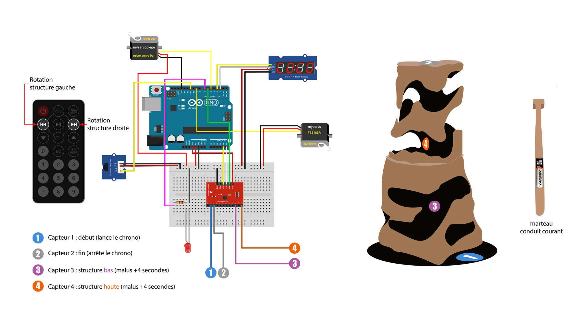

[**home**](../README.md)

# Yggdrasil

## Scénario

Yggdrasil est un jeu électronique inspiré par l’histoire de Thor dans la mythologie nordique dans laquelle Thor va traverser l’arbre monde « Yggdrasil ». En partant d'« Helheim » la partie la plus basse de l'arbre pour arriver à son sommet « Ásgard ».

Le but du jeu :

Un seul joueur participe par partie, incarnant le Dieu Thor en prenant en main son marteau « Mjöllnir ». 

À l'aide de « Mjöllnir », il va lancer le chrono en appuyant sur la partie en cuivre placée au pied de l'arbre, puis parcourir le labyrinthe en prenant le moins de temps possible, tout en faisant attention au piège et en évitant au maximum de toucher les bords sous peine de prendre des malus de temps. Il mettra fin au chrono en appuyant sur la tige de fer qui dépasse au sommet.

Dans un second temps, il est possible aussi de jouer en duo. L'un incarnant Thor et l'autre incarnant Loki. Loki a pour but d'entraver la quête de Thor. Pour cela, celui-ci a en sa possession une télécommande capable de faire tourner la structure entière (gauche ou droite) durant quelques secondes et de façon assez lente.

## Notice de montage

### Liste des matériaux :

1 LED Rouge
1 compteur
Une carte Arduino et son câble USB
Un breadboard
Résistance : 10k pour les boutons
Carton plume
Multitude de fils (Prendre plusieurs couleurs pour se repérer dans le montage)
Peinture conductrice
Infrarouge + Télécommande
Scotch noir & conducteur
Colle chaudes
Tige de fer
2 Moteurs: Un pour le piège, un pour tourner la structure

### Première étape, la structure :

Imprimer la **structure 3D** (Partie haute + Partie Basse + Marteau)

Peindre le chemin du labyrinthe avec de la **peinture conductrice.**

Enrouler le marteau de **scotch conducteur** (Cuivre)

Dans la partie haute, faire traverser une **tige de fer** de façon qu'elle sorte des deux extrémités, et la tordre au niveau de la partie du dessus pour qu'elle soit positionnée juste au-dessus de la sortie du labyrinthe. Comme indiqué sur le "schéma_extérieur".

Utiliser la **colle chaude** pour fixer le **moteur** qui va actionner le **piège** en haut de la "structure basse" comme indiqué sur le "schéma_intérieur".

Pour construire le support de la structure, utiliser du **carton plume**. À l'aide d'un **cutter**, découper des fines lamelles, afin de pouvoir enrouler le **carton plume** et créer un **cylindre**.

Ensuite, découper toujours dans du carton plume, 2 cercles de la même taille du cylindre pour avoir un couvercle et un support pour le cylindre. Les relier avec de la colle chaude.

Pour finir, découper des parties dans le cylindre pour faire sortir : le **compteur** et la **LED Rouge** sur le côté, ainsi que le **moteur** qui sera positionné en dessous sur le support du cylindre. Penser à faire sortir le capteur d'infrarouge pour capter le signal de la télécommande.

Dans ce **cylindre** vous allez pouvoir déposer tous les **composants** nécessaires au montage.

### Deuxième étape, les branchements :

Pour tout ce qui est branchement, commencer par suivre le schéma_composant. (Prévoir des fils conducteurs plus longs pour les parties qui seront reliées dans la structure 3D )

Une fois que les branchements sont effectués.

Reliez le capteur 1 à un petit bout de scotch conducteur au pied de l'entrée du labyrinthe.

Reliez le capteur 2 à la tige de fer à l'intérieur de la structure haute.

Reliez le capteur 3 à la peinture conductrice, de la partie basse.

Reliez le capteur 4 à la peinture conductrice de la partie haute.

Brancher une batterie externe à la carte arduino et la positionner dans le cylindre avec tous les autres composants.

### Troisième étape, lancer le jeu :

Une fois le code téléversé sur la carte arduino et tous les branchements bien réalisé.

Il vous suffit de toucher avec le marteau le capteur à l'entrée du labyrinthe pour lancer le chrono, éviter au maximum de toucher les parties avec de la peinture conductrice et atteindre le capteur à la sortie du labyrinthe pour terminer la partie.

Pour finir observer son score sur le compteur.

[**home**](../README.md)